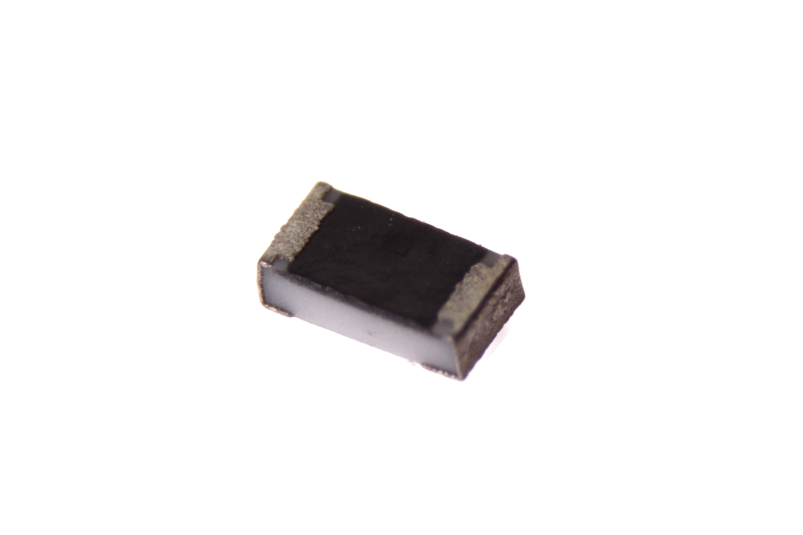
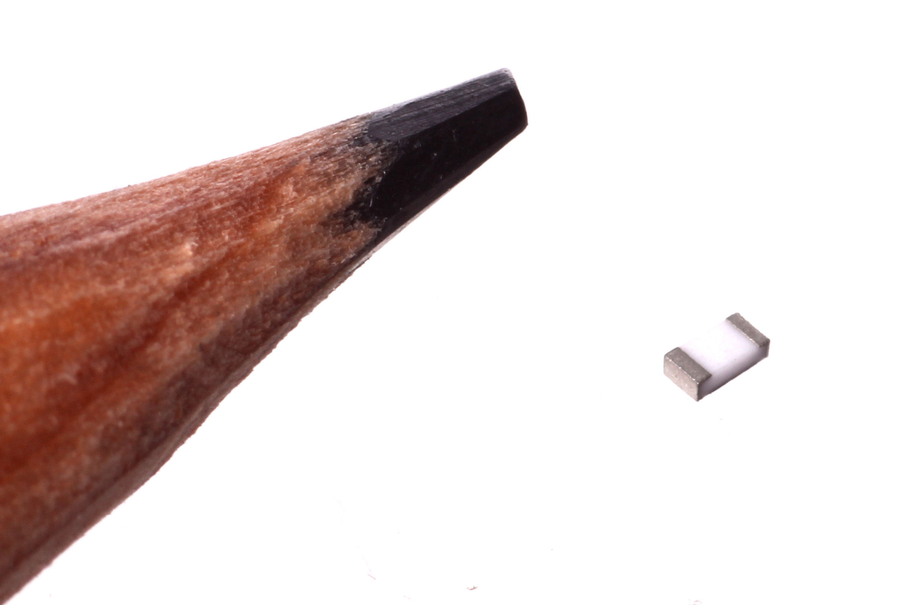
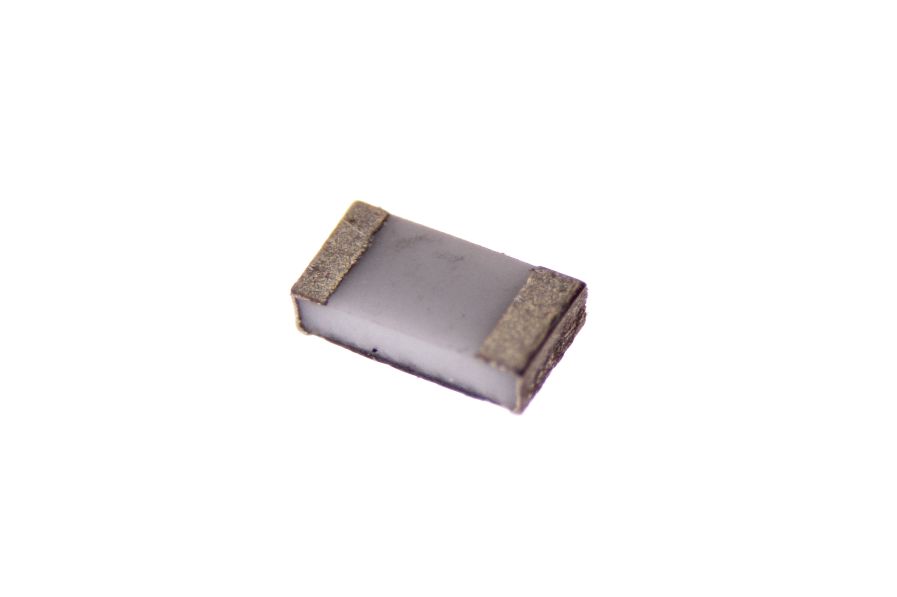

Contents
========

* [RESE-0603-X-O163-67>SMD (0603) 16k Ohm Resistor 1%](#rese-0603-x-o163-67smd-0603-16k-ohm-resistor-1)
	* [Images](#images)
	* [Datasheets](#datasheets)
	* [EDA](#eda)
		* [Footprints](#footprints)
		* [Symbols](#symbols)
	* [Tags](#tags)
  
![][im]
# RESE-0603-X-O163-67>SMD (0603) 16k Ohm Resistor 1%

- ID: RESE-0603-X-O163-67
- Name: RESE-0603-X-O163-67

## Images
  
  

|Main|Reference|Bottom|
| :---: | :---: | :---: |
||||

## Datasheets

- Datasheet: [datasheet.pdf](datasheet.pdf)

## EDA

### Footprints
  

|||||
| :---: | :---: | :---: | :---: |

### Symbols

## Tags

- index: 553
- oompID: RESE-0603-X-O163-67
- name: SMD (0603) 16k Ohm Resistor 1%
- hexID: R6163A
- oompDesc: O163
- oompSort: RESE0603O163
- oompType: RESE
- oompSize: 0603
- oompColor: X
- oompIndex: 67
- oompVersion: 999
- ooWidth: 0.8mm
- ooHeight: 0.45mm
- ooLength: 1.6mm
- oompBbls: template;XXXX-0603-X-XXXX-XX-bbls
- oompDiag: template;XXXX-0603-X-XXXX-XX-diag
- oompIden: template;XXXX-0603-X-XXXX-XX-iden
- oompSchem: template;RESE-XXXX-X-XXXX-XX-schem
- oompSimp: template;XXXX-0603-X-XXXX-XX-simp
- ooDesignator: R1

[im]: image_600.jpg
