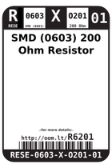
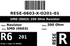
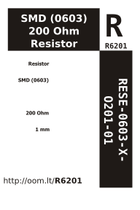

Contents
========

* [R6201 > SMD (0603) 200 Ohm Resistor](#r6201--smd-0603-200-ohm-resistor)
	* [Datasheets](#datasheets)
	* [Labels](#labels)
	* [EDA](#eda)
	* [Images](#images)
	* [Tags](#tags)
  
![][im]
# R6201 > SMD (0603) 200 Ohm Resistor

- ID: RESE-0603-X-O201-01
- Hex ID: R6201
- Name: SMD (0603) 200 Ohm Resistor
- Description: SMD (0603) 200 Ohm Resistor
- Long Link: [http://oom.lt/RESE-0603-X-O201-01](http://oom.lt/RESE-0603-X-O201-01)
- Short Link: [http://oom.lt/R6201](http://oom.lt/R6201)

## Datasheets

- Datasheet: [datasheet.pdf](datasheet.pdf)

## Labels
  
  

|label-front|label-inventory|label-spec|
| :---: | :---: | :---: |
||||

## EDA

### Instances
  
  
Used 10 times.  
Prevalance: (10\10986) 0.091%  

|OOMP Instances|
| :---: |
|[PROJ-SPAR-12041-STAN-01  AT42QT1010 Capacitive Touch Breakout  Used 1 times. R3](https://github.com/oomlout/oomlout_OOMP_projects/tree/main/PROJ-SPAR-12041-STAN-01/)|
|[PROJ-SPAR-13287-STAN-01  ESP8266 WiFi Shield  Used 3 times. R2, R4, R6](https://github.com/oomlout/oomlout_OOMP_projects/tree/main/PROJ-SPAR-13287-STAN-01/)|
|[PROJ-SPAR-13711-STAN-01  ESP8266 Thing Dev 4H  Used 3 times. R3, R4, R6](https://github.com/oomlout/oomlout_OOMP_projects/tree/main/PROJ-SPAR-13711-STAN-01/)|
|[PROJ-SPAR-13735-STAN-01  LilyPad Tri-Color LED  Used 1 times. R1](https://github.com/oomlout/oomlout_OOMP_projects/tree/main/PROJ-SPAR-13735-STAN-01/)|
|[PROJ-SPAR-13794-STAN-01  Blynk Board ESP8266  Used 1 times. R9](https://github.com/oomlout/oomlout_OOMP_projects/tree/main/PROJ-SPAR-13794-STAN-01/)|
|[PROJ-SPAR-14891-STAN-01  gator starter  Used 1 times. R8](https://github.com/oomlout/oomlout_OOMP_projects/tree/main/PROJ-SPAR-14891-STAN-01/)|

### Symbols

## Images
  
  

|image|image_RE|image_BOTTOM|label-front|label-inventory|label-spec|
| :---: | :---: | :---: | :---: | :---: | :---: |
|||||||

## Tags

- oompID: RESE-0603-X-O201-01
- name: SMD (0603) 200 Ohm Resistor
- hexID: R6201
- ooPackageMarking: 201
- oompDesc: O201
- oompSort: RESE0603O201
- oompType: RESE
- oompSize: 0603
- oompColor: X
- oompIndex: 01
- oompVersion: 999
- ooWidth: 0.8mm
- ooHeight: 0.45mm
- ooLength: 1.6mm
- oompBbls: template;XXXX-0603-X-XXXX-XX-bbls
- oompDiag: template;XXXX-0603-X-XXXX-XX-diag
- oompIden: template;XXXX-0603-X-XXXX-XX-iden
- oompSchem: template;RESE-XXXX-X-XXXX-XX-schem
- oompSimp: template;XXXX-0603-X-XXXX-XX-simp
- ooDesignator: R1
- oompInstances: {'PROJECT': 'PROJ-SPAR-12041-STAN-01', 'ID': 'R3'}
- oompInstances: {'PROJECT': 'PROJ-SPAR-13287-STAN-01', 'ID': 'R2'}
- oompInstances: {'PROJECT': 'PROJ-SPAR-13287-STAN-01', 'ID': 'R4'}
- oompInstances: {'PROJECT': 'PROJ-SPAR-13287-STAN-01', 'ID': 'R6'}
- oompInstances: {'PROJECT': 'PROJ-SPAR-13711-STAN-01', 'ID': 'R3'}
- oompInstances: {'PROJECT': 'PROJ-SPAR-13711-STAN-01', 'ID': 'R4'}
- oompInstances: {'PROJECT': 'PROJ-SPAR-13711-STAN-01', 'ID': 'R6'}
- oompInstances: {'PROJECT': 'PROJ-SPAR-13735-STAN-01', 'ID': 'R1'}
- oompInstances: {'PROJECT': 'PROJ-SPAR-13794-STAN-01', 'ID': 'R9'}
- oompInstances: {'PROJECT': 'PROJ-SPAR-14891-STAN-01', 'ID': 'R8'}

[im]: image_450.jpg
