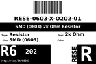
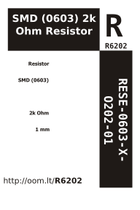

Contents
========

* [R6202 > SMD (0603) 2k Ohm Resistor](#r6202--smd-0603-2k-ohm-resistor)
	* [Datasheets](#datasheets)
	* [Labels](#labels)
	* [EDA](#eda)
	* [Images](#images)
	* [Tags](#tags)
  
![][im]
# R6202 > SMD (0603) 2k Ohm Resistor

- ID: RESE-0603-X-O202-01
- Hex ID: R6202
- Name: SMD (0603) 2k Ohm Resistor
- Description: SMD (0603) 2k Ohm Resistor
- Long Link: [http://oom.lt/RESE-0603-X-O202-01](http://oom.lt/RESE-0603-X-O202-01)
- Short Link: [http://oom.lt/R6202](http://oom.lt/R6202)

## Datasheets

- Datasheet: [datasheet.pdf](datasheet.pdf)

## Labels
  
  

|label-front|label-inventory|label-spec|
| :---: | :---: | :---: |
||||

## EDA
  

### Instances
  
Used 3 times.  
Prevalance: (3\10986) 0.0273%  

|OOMP Instances|
| :---: |
|[PROJ-SPAR-10101-STAN-01  Window Comparator  Used 1 times. R7](https://github.com/oomlout/oomlout_OOMP_projects/tree/main/PROJ-SPAR-10101-STAN-01/)|
|[PROJ-SPAR-11520-STAN-01  Fio v3  Used 1 times. R5](https://github.com/oomlout/oomlout_OOMP_projects/tree/main/PROJ-SPAR-11520-STAN-01/)|
|[PROJ-SPAR-14063-STAN-01  LilyPad LilyMini ProtoSnap  Used 1 times. R3](https://github.com/oomlout/oomlout_OOMP_projects/tree/main/PROJ-SPAR-14063-STAN-01/)|

## Images
  
  

|image|image_RE|image_BOTTOM|label-front|label-inventory|label-spec|
| :---: | :---: | :---: | :---: | :---: | :---: |
|||||||

## Tags

- oompID: RESE-0603-X-O202-01
- name: SMD (0603) 2k Ohm Resistor
- hexID: R6202
- ooPackageMarking: 202
- oompDesc: O202
- oompSort: RESE0603O202
- oompType: RESE
- oompSize: 0603
- oompColor: X
- oompIndex: 01
- oompVersion: 999
- ooWidth: 0.8mm
- ooHeight: 0.45mm
- ooLength: 1.6mm
- oompBbls: template;XXXX-0603-X-XXXX-XX-bbls
- oompDiag: template;XXXX-0603-X-XXXX-XX-diag
- oompIden: template;XXXX-0603-X-XXXX-XX-iden
- oompSchem: template;RESE-XXXX-X-XXXX-XX-schem
- oompSimp: template;XXXX-0603-X-XXXX-XX-simp
- ooDesignator: R1
- oompInstances: {'PROJECT': 'PROJ-SPAR-10101-STAN-01', 'ID': 'R7'}
- oompInstances: {'PROJECT': 'PROJ-SPAR-11520-STAN-01', 'ID': 'R5'}
- oompInstances: {'PROJECT': 'PROJ-SPAR-14063-STAN-01', 'ID': 'R3'}

[im]: image_450.jpg
