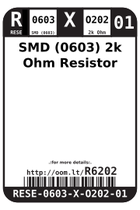

Contents
========

* [RESE-6O202-01 > SMD (0603) 2k Ohm Resistor](#rese-6o202-01--smd-0603-2k-ohm-resistor)
	* [Datasheets](#datasheets)
	* [Labels](#labels)
	* [EDA](#eda)
	* [Images](#images)
	* [Tags](#tags)
  
![][im]
# RESE-6O202-01 > SMD (0603) 2k Ohm Resistor

- ID: RESE-0603-X-O202-01
- Hex ID: RESE-6O202-01
- Name: SMD (0603) 2k Ohm Resistor
- Description: SMD (0603) 2k Ohm Resistor
- Long Link: [http://oom.lt/RESE-0603-X-O202-01](http://oom.lt/RESE-0603-X-O202-01)
- Short Link: [http://oom.lt/RESE-6O202-01](http://oom.lt/RESE-6O202-01)

## Datasheets

- Datasheet: [datasheet.pdf](datasheet.pdf)

## Labels
  
  

|label-front|label-inventory|label-spec|
| :---: | :---: | :---: |
||||

## EDA
  

### Instances
  
Used 3 times.  
Prevalance: (3\10986) 0.0273%  

|Project|Occur- rences|Identifiers|
| :---: | :---: | :---: |
|[PROJ-SPAR-10101-STAN-01 Window Comparator](https://github.com/oomlout/oomlout_OOMP_projects/tree/main/PROJ-SPAR-10101-STAN-01/)|[1](https://github.com/oomlout/oomlout_OOMP_projects/tree/main/PROJ-SPAR-10101-STAN-01/)|[R7](https://github.com/oomlout/oomlout_OOMP_projects/tree/main/PROJ-SPAR-10101-STAN-01/)|
|[PROJ-SPAR-11520-STAN-01 Fio v3](https://github.com/oomlout/oomlout_OOMP_projects/tree/main/PROJ-SPAR-11520-STAN-01/)|[1](https://github.com/oomlout/oomlout_OOMP_projects/tree/main/PROJ-SPAR-11520-STAN-01/)|[R5](https://github.com/oomlout/oomlout_OOMP_projects/tree/main/PROJ-SPAR-11520-STAN-01/)|
|[PROJ-SPAR-14063-STAN-01 LilyPad LilyMini ProtoSnap](https://github.com/oomlout/oomlout_OOMP_projects/tree/main/PROJ-SPAR-14063-STAN-01/)|[1](https://github.com/oomlout/oomlout_OOMP_projects/tree/main/PROJ-SPAR-14063-STAN-01/)|[R3](https://github.com/oomlout/oomlout_OOMP_projects/tree/main/PROJ-SPAR-14063-STAN-01/)|

## Images
  
  

|image|image_RE|image_BOTTOM|label-front|label-inventory|label-spec|
| :---: | :---: | :---: | :---: | :---: | :---: |
|||||||

## Tags

- oompType: RESE
- oompSize: 0603
- oompColor: X
- oompDesc: O202
- oompIndex: 01
- oplPartNumber: {'code': 'C-JLCC', 'name': 'JLC Parts Library', 'partID': 'C22975', 'desc': '100mW Thick Film Resistors 75V ??100ppm/?? ??1% -55??~+155?? 2k?? 0603  Chip Resistor - Surface Mount ROHS'}
- distributorPartNumber: {'code': 'C-LCSC', 'name': 'LCSC', 'partID': 'C22975'}
- manufacturerPartNumber: {'code': 'C-XXXX', 'name': 'UNI-ROYAL(Uniroyal Elec)', 'partID': '0603WAF2001T5E'}
- hexID: RESE-6O202-01
- oompID: RESE-0603-X-O202-01
- oompInstances: {'PROJECT': 'PROJ-SPAR-10101-STAN-01', 'ID': 'R7'}
- oompInstances: {'PROJECT': 'PROJ-SPAR-11520-STAN-01', 'ID': 'R5'}
- oompInstances: {'PROJECT': 'PROJ-SPAR-14063-STAN-01', 'ID': 'R3'}

[im]: image_450.jpg
