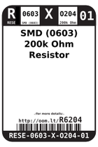
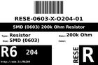
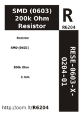

Contents
========

* [R6204 > SMD (0603) 200k Ohm Resistor](#r6204--smd-0603-200k-ohm-resistor)
	* [Datasheets](#datasheets)
	* [Labels](#labels)
	* [EDA](#eda)
	* [Images](#images)
	* [Tags](#tags)
  
![][im]
# R6204 > SMD (0603) 200k Ohm Resistor

- ID: RESE-0603-X-O204-01
- Hex ID: R6204
- Name: SMD (0603) 200k Ohm Resistor
- Description: SMD (0603) 200k Ohm Resistor
- Long Link: [http://oom.lt/RESE-0603-X-O204-01](http://oom.lt/RESE-0603-X-O204-01)
- Short Link: [http://oom.lt/R6204](http://oom.lt/R6204)

## Datasheets

- Datasheet: [datasheet.pdf](datasheet.pdf)

## Labels
  
  

|label-front|label-inventory|label-spec|
| :---: | :---: | :---: |
||||

## EDA

### Symbols

## Images
  
  

|image|image_RE|image_BOTTOM|label-front|label-inventory|label-spec|
| :---: | :---: | :---: | :---: | :---: | :---: |
|||||||

## Tags

- oompID: RESE-0603-X-O204-01
- name: SMD (0603) 200k Ohm Resistor
- hexID: R6204
- ooPackageMarking: 204
- oompDesc: O204
- oompType: RESE
- oompSize: 0603
- oompColor: X
- oompIndex: 01
- oompVersion: 999
- ooWidth: 0.8mm
- ooHeight: 0.45mm
- ooLength: 1.6mm
- oompBbls: template;XXXX-0603-X-XXXX-XX-bbls
- oompDiag: template;XXXX-0603-X-XXXX-XX-diag
- oompIden: template;XXXX-0603-X-XXXX-XX-iden
- oompSchem: template;RESE-XXXX-X-XXXX-XX-schem
- oompSimp: template;XXXX-0603-X-XXXX-XX-simp
- ooDesignator: R1

[im]: image_450.jpg
