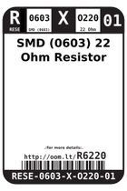
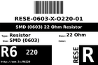
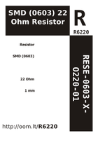
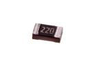

Contents
========

* [R6220 > SMD (0603) 22 Ohm Resistor](#r6220--smd-0603-22-ohm-resistor)
	* [Datasheets](#datasheets)
	* [Labels](#labels)
	* [EDA](#eda)
	* [Images](#images)
	* [Tags](#tags)
  
![][im]
# R6220 > SMD (0603) 22 Ohm Resistor

- ID: RESE-0603-X-O220-01
- Hex ID: R6220
- Name: SMD (0603) 22 Ohm Resistor
- Description: SMD (0603) 22 Ohm Resistor
- Long Link: [http://oom.lt/RESE-0603-X-O220-01](http://oom.lt/RESE-0603-X-O220-01)
- Short Link: [http://oom.lt/R6220](http://oom.lt/R6220)

## Datasheets

- Datasheet: [datasheet.pdf](datasheet.pdf)

## Labels
  
  

|label-front|label-inventory|label-spec|
| :---: | :---: | :---: |
||||

## EDA

### Instances
  
  
Used 57 times.  
Prevalance: (57\10986) 0.5188%  

|OOMP Instances|
| :---: |
|[PROJ-ADAF-1312-STAN-01  Adafruit_Breadboard_NeoPixel_PCB  Used 2 times. R2, R3](https://github.com/oomlout/oomlout_OOMP_projects/tree/main/PROJ-ADAF-1312-STAN-01/)|
|[PROJ-ADAF-2771-STAN-01  Adafruit Feather 32u4 Basic Proto PCB  Used 2 times. R4, R5](https://github.com/oomlout/oomlout_OOMP_projects/tree/main/PROJ-ADAF-2771-STAN-01/)|
|[PROJ-ADAF-2795-STAN-01  Adafruit Feather 32u4 Adalogger PCB  Used 2 times. R4, R5](https://github.com/oomlout/oomlout_OOMP_projects/tree/main/PROJ-ADAF-2795-STAN-01/)|
|[PROJ-ADAF-2829-STAN-01  Adafruit Feather 32u4 Bluefruit LE PCB  Used 2 times. R4, R5](https://github.com/oomlout/oomlout_OOMP_projects/tree/main/PROJ-ADAF-2829-STAN-01/)|
|[PROJ-ADAF-3000-STAN-01  Adafruit Circuit Playground PCB  Used 2 times. R1, R2](https://github.com/oomlout/oomlout_OOMP_projects/tree/main/PROJ-ADAF-3000-STAN-01/)|
|[PROJ-ADAF-3027-STAN-01  Adafruit Feather 32u4 FONA PCB  Used 2 times. R4, R5](https://github.com/oomlout/oomlout_OOMP_projects/tree/main/PROJ-ADAF-3027-STAN-01/)|
|[PROJ-ADAF-3357-STAN-01  Adafruit Music Maker FeatherWing PCB  Used 2 times. R3, R4](https://github.com/oomlout/oomlout_OOMP_projects/tree/main/PROJ-ADAF-3357-STAN-01/)|
|[PROJ-ADAF-3533-STAN-01  Adafruit 0.96 160x80 TFT Display Breakout PCB  Used 1 times. R5](https://github.com/oomlout/oomlout_OOMP_projects/tree/main/PROJ-ADAF-3533-STAN-01/)|
|[PROJ-ADAF-3677-STAN-01  Adafruit ItsyBitsy 32u4 PCB  Used 2 times. R4, R5](https://github.com/oomlout/oomlout_OOMP_projects/tree/main/PROJ-ADAF-3677-STAN-01/)|
|[PROJ-ADAF-4383-STAN-01  Adafruit 1.14 inch 240x135 TFT PCB  Used 1 times. R5](https://github.com/oomlout/oomlout_OOMP_projects/tree/main/PROJ-ADAF-4383-STAN-01/)|
|[PROJ-ADAF-4481-STAN-01  Adafruit ItsyBitsy nRF52840 Express PCB  Used 2 times. R10, R11](https://github.com/oomlout/oomlout_OOMP_projects/tree/main/PROJ-ADAF-4481-STAN-01/)|
|[PROJ-ADAF-4500-STAN-01  Adafruit CLUE PCB  Used 2 times. R10, R11](https://github.com/oomlout/oomlout_OOMP_projects/tree/main/PROJ-ADAF-4500-STAN-01/)|
|[PROJ-ADAF-4516-STAN-01  Adafruit Feather nRF52840 Sense PCB  Used 2 times. R10, R11](https://github.com/oomlout/oomlout_OOMP_projects/tree/main/PROJ-ADAF-4516-STAN-01/)|
|[PROJ-ADAF-5100-STAN-01  Adafruit MacroPad RP2040 PCB  Used 2 times. R3, R4](https://github.com/oomlout/oomlout_OOMP_projects/tree/main/PROJ-ADAF-5100-STAN-01/)|
|[PROJ-ADAF-5201-STAN-01  Adafruit IS31FL3741 PCB  Used 2 times. R9, R23](https://github.com/oomlout/oomlout_OOMP_projects/tree/main/PROJ-ADAF-5201-STAN-01/)|
|[PROJ-ADAF-5217-STAN-01  Adafruit EyeLights LED Glasses and Driver PCB  Used 13 times. R4, R8, R10, R13, R16, R19, R22, R25, R27, R30, R33, R36, R39](https://github.com/oomlout/oomlout_OOMP_projects/tree/main/PROJ-ADAF-5217-STAN-01/)|
|[PROJ-ADAF-5300-STAN-01  Adafruit ESP32 S2 TFT Feather PCB  Used 1 times. R11](https://github.com/oomlout/oomlout_OOMP_projects/tree/main/PROJ-ADAF-5300-STAN-01/)|
|[PROJ-SPAR-11117-STAN-01  32U4 Breakout Board  Used 2 times. R2, R3](https://github.com/oomlout/oomlout_OOMP_projects/tree/main/PROJ-SPAR-11117-STAN-01/)|
|[PROJ-SPAR-11190-STAN-01  LilyPad Arduino USB  Used 2 times. R4, R5](https://github.com/oomlout/oomlout_OOMP_projects/tree/main/PROJ-SPAR-11190-STAN-01/)|
|[PROJ-SPAR-11520-STAN-01  Fio v3  Used 2 times. R11, R12](https://github.com/oomlout/oomlout_OOMP_projects/tree/main/PROJ-SPAR-11520-STAN-01/)|
|[PROJ-SPAR-13040-STAN-01  Edison UART Block  Used 1 times. R9](https://github.com/oomlout/oomlout_OOMP_projects/tree/main/PROJ-SPAR-13040-STAN-01/)|
|[PROJ-SPAR-13120-STAN-01  MG2639 Cellular Shield  Used 2 times. R10, R11](https://github.com/oomlout/oomlout_OOMP_projects/tree/main/PROJ-SPAR-13120-STAN-01/)|
|[PROJ-SPAR-13321-STAN-01  Photon RedBoard  Used 2 times. R1, R2](https://github.com/oomlout/oomlout_OOMP_projects/tree/main/PROJ-SPAR-13321-STAN-01/)|
|[PROJ-SPAR-13614-STAN-01  Qduino Mini SFE  Used 2 times. R3, R4](https://github.com/oomlout/oomlout_OOMP_projects/tree/main/PROJ-SPAR-13614-STAN-01/)|
|[PROJ-SPAR-14478-STAN-01  MaKeyMaKey  Used 2 times. R1, R2](https://github.com/oomlout/oomlout_OOMP_projects/tree/main/PROJ-SPAR-14478-STAN-01/)|

### Symbols

## Images
  
  

|image|image_RE|image_BOTTOM|label-front|label-inventory|label-spec|
| :---: | :---: | :---: | :---: | :---: | :---: |
|||||||

## Tags

- oompID: RESE-0603-X-O220-01
- name: SMD (0603) 22 Ohm Resistor
- hexID: R6220
- ooPackageMarking: 220
- oompDesc: O220
- oompSort: RESE0603O220
- oompType: RESE
- oompSize: 0603
- oompColor: X
- oompIndex: 01
- oompVersion: 999
- ooWidth: 0.8mm
- ooHeight: 0.45mm
- ooLength: 1.6mm
- oompBbls: template;XXXX-0603-X-XXXX-XX-bbls
- oompDiag: template;XXXX-0603-X-XXXX-XX-diag
- oompIden: template;XXXX-0603-X-XXXX-XX-iden
- oompSchem: template;RESE-XXXX-X-XXXX-XX-schem
- oompSimp: template;XXXX-0603-X-XXXX-XX-simp
- ooDesignator: R1
- oompInstances: {'PROJECT': 'PROJ-ADAF-1312-STAN-01', 'ID': 'R2'}
- oompInstances: {'PROJECT': 'PROJ-ADAF-1312-STAN-01', 'ID': 'R3'}
- oompInstances: {'PROJECT': 'PROJ-ADAF-2771-STAN-01', 'ID': 'R4'}
- oompInstances: {'PROJECT': 'PROJ-ADAF-2771-STAN-01', 'ID': 'R5'}
- oompInstances: {'PROJECT': 'PROJ-ADAF-2795-STAN-01', 'ID': 'R4'}
- oompInstances: {'PROJECT': 'PROJ-ADAF-2795-STAN-01', 'ID': 'R5'}
- oompInstances: {'PROJECT': 'PROJ-ADAF-2829-STAN-01', 'ID': 'R4'}
- oompInstances: {'PROJECT': 'PROJ-ADAF-2829-STAN-01', 'ID': 'R5'}
- oompInstances: {'PROJECT': 'PROJ-ADAF-3000-STAN-01', 'ID': 'R1'}
- oompInstances: {'PROJECT': 'PROJ-ADAF-3000-STAN-01', 'ID': 'R2'}
- oompInstances: {'PROJECT': 'PROJ-ADAF-3027-STAN-01', 'ID': 'R4'}
- oompInstances: {'PROJECT': 'PROJ-ADAF-3027-STAN-01', 'ID': 'R5'}
- oompInstances: {'PROJECT': 'PROJ-ADAF-3357-STAN-01', 'ID': 'R3'}
- oompInstances: {'PROJECT': 'PROJ-ADAF-3357-STAN-01', 'ID': 'R4'}
- oompInstances: {'PROJECT': 'PROJ-ADAF-3533-STAN-01', 'ID': 'R5'}
- oompInstances: {'PROJECT': 'PROJ-ADAF-3677-STAN-01', 'ID': 'R4'}
- oompInstances: {'PROJECT': 'PROJ-ADAF-3677-STAN-01', 'ID': 'R5'}
- oompInstances: {'PROJECT': 'PROJ-ADAF-4383-STAN-01', 'ID': 'R5'}
- oompInstances: {'PROJECT': 'PROJ-ADAF-4481-STAN-01', 'ID': 'R10'}
- oompInstances: {'PROJECT': 'PROJ-ADAF-4481-STAN-01', 'ID': 'R11'}
- oompInstances: {'PROJECT': 'PROJ-ADAF-4500-STAN-01', 'ID': 'R10'}
- oompInstances: {'PROJECT': 'PROJ-ADAF-4500-STAN-01', 'ID': 'R11'}
- oompInstances: {'PROJECT': 'PROJ-ADAF-4516-STAN-01', 'ID': 'R10'}
- oompInstances: {'PROJECT': 'PROJ-ADAF-4516-STAN-01', 'ID': 'R11'}
- oompInstances: {'PROJECT': 'PROJ-ADAF-5100-STAN-01', 'ID': 'R3'}
- oompInstances: {'PROJECT': 'PROJ-ADAF-5100-STAN-01', 'ID': 'R4'}
- oompInstances: {'PROJECT': 'PROJ-ADAF-5201-STAN-01', 'ID': 'R9'}
- oompInstances: {'PROJECT': 'PROJ-ADAF-5201-STAN-01', 'ID': 'R23'}
- oompInstances: {'PROJECT': 'PROJ-ADAF-5217-STAN-01', 'ID': 'R4'}
- oompInstances: {'PROJECT': 'PROJ-ADAF-5217-STAN-01', 'ID': 'R8'}
- oompInstances: {'PROJECT': 'PROJ-ADAF-5217-STAN-01', 'ID': 'R10'}
- oompInstances: {'PROJECT': 'PROJ-ADAF-5217-STAN-01', 'ID': 'R13'}
- oompInstances: {'PROJECT': 'PROJ-ADAF-5217-STAN-01', 'ID': 'R16'}
- oompInstances: {'PROJECT': 'PROJ-ADAF-5217-STAN-01', 'ID': 'R19'}
- oompInstances: {'PROJECT': 'PROJ-ADAF-5217-STAN-01', 'ID': 'R22'}
- oompInstances: {'PROJECT': 'PROJ-ADAF-5217-STAN-01', 'ID': 'R25'}
- oompInstances: {'PROJECT': 'PROJ-ADAF-5217-STAN-01', 'ID': 'R27'}
- oompInstances: {'PROJECT': 'PROJ-ADAF-5217-STAN-01', 'ID': 'R30'}
- oompInstances: {'PROJECT': 'PROJ-ADAF-5217-STAN-01', 'ID': 'R33'}
- oompInstances: {'PROJECT': 'PROJ-ADAF-5217-STAN-01', 'ID': 'R36'}
- oompInstances: {'PROJECT': 'PROJ-ADAF-5217-STAN-01', 'ID': 'R39'}
- oompInstances: {'PROJECT': 'PROJ-ADAF-5300-STAN-01', 'ID': 'R11'}
- oompInstances: {'PROJECT': 'PROJ-SPAR-11117-STAN-01', 'ID': 'R2'}
- oompInstances: {'PROJECT': 'PROJ-SPAR-11117-STAN-01', 'ID': 'R3'}
- oompInstances: {'PROJECT': 'PROJ-SPAR-11190-STAN-01', 'ID': 'R4'}
- oompInstances: {'PROJECT': 'PROJ-SPAR-11190-STAN-01', 'ID': 'R5'}
- oompInstances: {'PROJECT': 'PROJ-SPAR-11520-STAN-01', 'ID': 'R11'}
- oompInstances: {'PROJECT': 'PROJ-SPAR-11520-STAN-01', 'ID': 'R12'}
- oompInstances: {'PROJECT': 'PROJ-SPAR-13040-STAN-01', 'ID': 'R9'}
- oompInstances: {'PROJECT': 'PROJ-SPAR-13120-STAN-01', 'ID': 'R10'}
- oompInstances: {'PROJECT': 'PROJ-SPAR-13120-STAN-01', 'ID': 'R11'}
- oompInstances: {'PROJECT': 'PROJ-SPAR-13321-STAN-01', 'ID': 'R1'}
- oompInstances: {'PROJECT': 'PROJ-SPAR-13321-STAN-01', 'ID': 'R2'}
- oompInstances: {'PROJECT': 'PROJ-SPAR-13614-STAN-01', 'ID': 'R3'}
- oompInstances: {'PROJECT': 'PROJ-SPAR-13614-STAN-01', 'ID': 'R4'}
- oompInstances: {'PROJECT': 'PROJ-SPAR-14478-STAN-01', 'ID': 'R1'}
- oompInstances: {'PROJECT': 'PROJ-SPAR-14478-STAN-01', 'ID': 'R2'}

[im]: image_450.jpg
