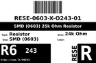
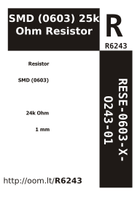
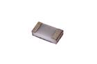

Contents
========

* [R6243 > SMD (0603) 25k Ohm Resistor](#r6243--smd-0603-25k-ohm-resistor)
	* [Labels](#labels)
	* [EDA](#eda)
	* [Images](#images)
	* [Tags](#tags)

# R6243 > SMD (0603) 25k Ohm Resistor

- ID: RESE-0603-X-O243-01
- Hex ID: R6243
- Name: SMD (0603) 25k Ohm Resistor
- Description: SMD (0603) 25k Ohm Resistor
- Long Link: [http://oom.lt/RESE-0603-X-O243-01](http://oom.lt/RESE-0603-X-O243-01)
- Short Link: [http://oom.lt/R6243](http://oom.lt/R6243)

## Labels
  
  

|label-front|label-inventory|label-spec|
| :---: | :---: | :---: |
||||

## EDA

### Symbols

## Images
  
  

|image_RE|image_BOTTOM|label-front|label-inventory|label-spec|
| :---: | :---: | :---: | :---: | :---: |
||||||

## Tags

- oompID: RESE-0603-X-O243-01
- name: SMD (0603) 25k Ohm Resistor
- hexID: R6243
- ooPackageMarking: 243
- oompType: RESE
- oompSize: 0603
- oompColor: X
- oompDesc: O243
- oompIndex: 01
- oompVersion: 999
- ooWidth: 0.8mm
- ooHeight: 0.45mm
- ooLength: 1.6mm
- oompBbls: template;XXXX-0603-X-XXXX-XX-bbls
- oompDiag: template;XXXX-0603-X-XXXX-XX-diag
- oompIden: template;XXXX-0603-X-XXXX-XX-iden
- oompSchem: template;RESE-XXXX-X-XXXX-XX-schem
- oompSimp: template;XXXX-0603-X-XXXX-XX-simp
- ooDesignator: R1
- oompInstances: {'PROJECT': 'PROJ-ADAF-4683-STAN-01', 'ID': 'R3'}
