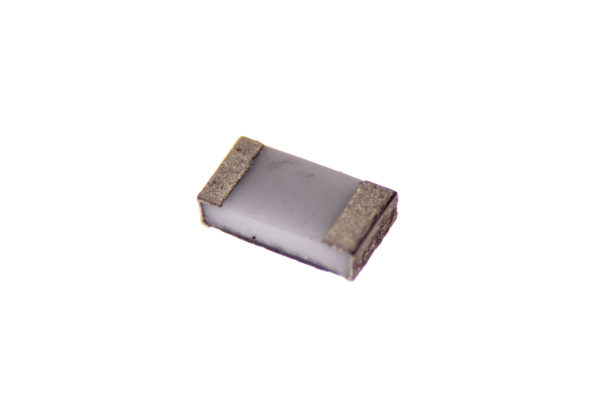

Contents
========

* [RESE-0603-X-O274-01>SMD (0603) 280k Ohm Resistor](#rese-0603-x-o274-01smd-0603-280k-ohm-resistor)
	* [Images](#images)
	* [Datasheets](#datasheets)
	* [EDA](#eda)
		* [Footprints](#footprints)
		* [Symbols](#symbols)
	* [Tags](#tags)

# RESE-0603-X-O274-01>SMD (0603) 280k Ohm Resistor

- ID: RESE-0603-X-O274-01
- Name: RESE-0603-X-O274-01

## Images
  
  

|Reference|Bottom|
| :---: | :---: |
|||

## Datasheets

- Datasheet: [datasheet.pdf](datasheet.pdf)

## EDA

### Footprints
  

|  [eagle/Adafruit-Eagle-Library/adafruit/R0603](https://github.com/oomlout/oomlout_OOMP_eda/tree/main/footprints/eagle/Adafruit-Eagle-Library/adafruit/R0603/)||||
| :---: | :---: | :---: | :---: |

### Symbols

## Tags

- index: 588
- oompID: RESE-0603-X-O274-01
- name: SMD (0603) 280k Ohm Resistor
- hexID: R6274
- ooPackageMarking: 274
- oompType: RESE
- oompSize: 0603
- oompColor: X
- oompDesc: O274
- oompIndex: 01
- oompVersion: 999
- ooWidth: 0.8mm
- ooHeight: 0.45mm
- ooLength: 1.6mm
- oompBbls: template;XXXX-0603-X-XXXX-XX-bbls
- oompDiag: template;XXXX-0603-X-XXXX-XX-diag
- oompIden: template;XXXX-0603-X-XXXX-XX-iden
- oompSchem: template;RESE-XXXX-X-XXXX-XX-schem
- oompSimp: template;XXXX-0603-X-XXXX-XX-simp
- ooDesignator: R1
- footprintEagle: Adafruit-Eagle-Library/adafruit/R0603
- footprintKicad: kicad-footprints/Resistor_SMD/R_0603_1608Metric_Pad0.98x0.95mm_HandSolder
- footprintKicad: kicad-footprints/Resistor_SMD/R_0603_1608Metric
