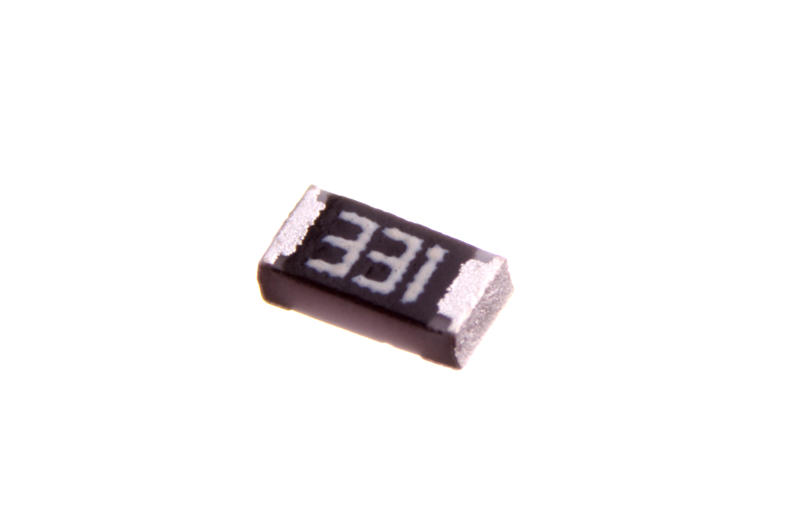
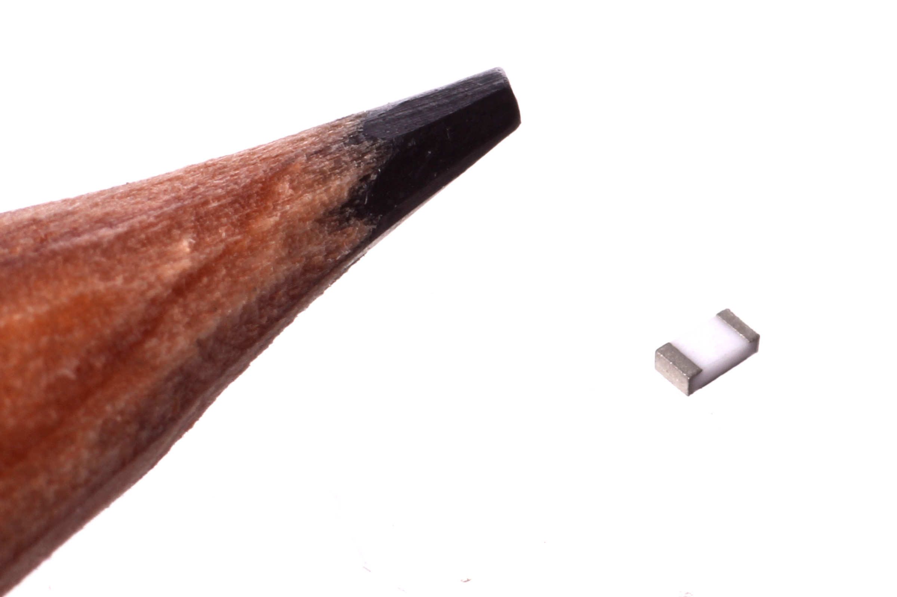
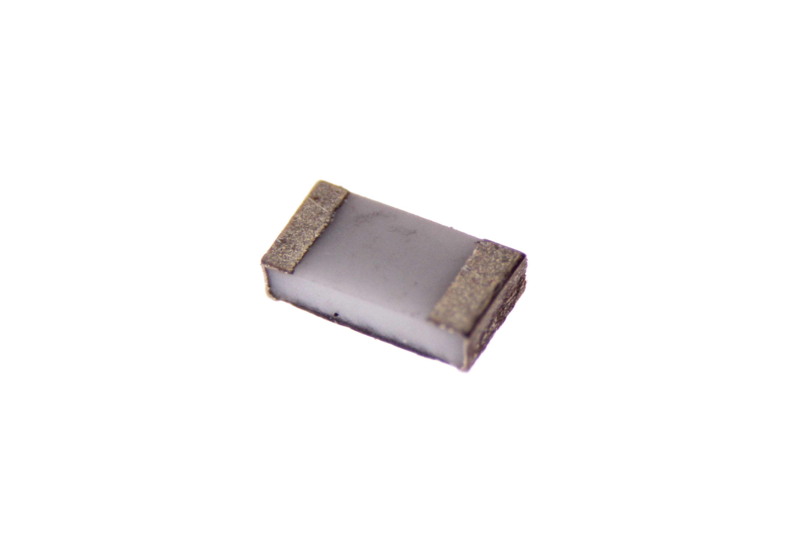

Contents
========

* [RESE-0603-X-O331-01>SMD (0603) 330 Ohm Resistor](#rese-0603-x-o331-01smd-0603-330-ohm-resistor)
	* [Images](#images)
	* [Datasheets](#datasheets)
	* [EDA](#eda)
		* [Footprints](#footprints)
		* [Symbols](#symbols)
	* [Tags](#tags)

# RESE-0603-X-O331-01>SMD (0603) 330 Ohm Resistor

- ID: RESE-0603-X-O331-01
- Name: RESE-0603-X-O331-01

## Images
  
  

|Main|Reference|Bottom|
| :---: | :---: | :---: |
||||

## Datasheets

- Datasheet: [datasheet.pdf](datasheet.pdf)

## EDA

### Footprints
  

|||||
| :---: | :---: | :---: | :---: |

### Symbols

## Tags

- index: 598
- index: 4102
- oompID: RESE-0603-X-O331-01
- name: SMD (0603) 330 Ohm Resistor
- hexID: R6331
- oompSort: 06030000330
- oompType: RESE
- oompSize: 0603
- oompColor: X
- oompDesc: O331
- oompIndex: 01
- oompVersion: 99
- ooWidth: 1.6 mm
- ooLength: 3.2 mm
- ooManufacturer: Yageo
- ooManufacturerPartNumber: RC0603JR-07330RL
- ooMaterial: Carbon Film
- ooPowerRating: 1/10 W
- ooMaxVoltage: 50 V
- ooTolerance: 5%
- ooSEEEDsku: 0010430P1
- ooSEEEDdesc: SMD RES 330R-5%-1/10W
- ooSEEED3dModel: http://www.seeedstudio.com/wiki/File:Resistor0603.zip
- oompClass: Surface Mount
- oompClassCode: SMDS
- oompBbls: template;XXXX-0603-X-XXXX-XX-bbls
- oompDiag: template;XXXX-0603-X-XXXX-XX-diag
- oompIden: template;XXXX-0603-X-XXXX-XX-iden
- oompSchem: template;RESE-XXXX-X-XXXX-XX-schem
- oompSimp: template;XXXX-0603-X-XXXX-XX-simp
- ooDesignator: R1
