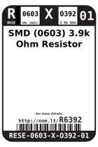
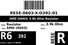
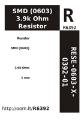
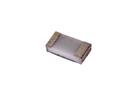

Contents
========

* [R6392 > SMD (0603) 3.9k Ohm Resistor](#r6392--smd-0603-39k-ohm-resistor)
	* [Datasheets](#datasheets)
	* [Labels](#labels)
	* [EDA](#eda)
	* [Images](#images)
	* [Tags](#tags)
  
![][im]
# R6392 > SMD (0603) 3.9k Ohm Resistor

- ID: RESE-0603-X-O392-01
- Hex ID: R6392
- Name: SMD (0603) 3.9k Ohm Resistor
- Description: SMD (0603) 3.9k Ohm Resistor
- Long Link: [http://oom.lt/RESE-0603-X-O392-01](http://oom.lt/RESE-0603-X-O392-01)
- Short Link: [http://oom.lt/R6392](http://oom.lt/R6392)

## Datasheets

- Datasheet: [datasheet.pdf](datasheet.pdf)

## Labels
  
  

|label-front|label-inventory|label-spec|
| :---: | :---: | :---: |
||||

## EDA

### Instances
  
  
Used 3 times.  
Prevalance: (3\10986) 0.0273%  

|OOMP Instances|
| :---: |
|[PROJ-SPAR-13672-STAN-01  SAMD21 Dev Breakout  Used 1 times. R1](https://github.com/oomlout/oomlout_OOMP_projects/tree/main/PROJ-SPAR-13672-STAN-01/)|
|[PROJ-SPAR-13956-STAN-01  Weather Shield  Used 1 times. R8](https://github.com/oomlout/oomlout_OOMP_projects/tree/main/PROJ-SPAR-13956-STAN-01/)|
|[PROJ-SPAR-14812-STAN-01  RedBoard Turbo  Used 1 times. R1](https://github.com/oomlout/oomlout_OOMP_projects/tree/main/PROJ-SPAR-14812-STAN-01/)|

### Symbols

## Images
  
  

|image|image_RE|image_BOTTOM|label-front|label-inventory|label-spec|
| :---: | :---: | :---: | :---: | :---: | :---: |
|||||||

## Tags

- oompID: RESE-0603-X-O392-01
- name: SMD (0603) 3.9k Ohm Resistor
- hexID: R6392
- ooPackageMarking: 392
- oompSort: RESE0603O392
- oompType: RESE
- oompSize: 0603
- oompColor: X
- oompDesc: O392
- oompIndex: 01
- oompVersion: 999
- ooWidth: 0.8mm
- ooHeight: 0.45mm
- ooLength: 1.6mm
- oompBbls: template;XXXX-0603-X-XXXX-XX-bbls
- oompDiag: template;XXXX-0603-X-XXXX-XX-diag
- oompIden: template;XXXX-0603-X-XXXX-XX-iden
- oompSchem: template;RESE-XXXX-X-XXXX-XX-schem
- oompSimp: template;XXXX-0603-X-XXXX-XX-simp
- ooDesignator: R1
- oompInstances: {'PROJECT': 'PROJ-SPAR-13672-STAN-01', 'ID': 'R1'}
- oompInstances: {'PROJECT': 'PROJ-SPAR-13956-STAN-01', 'ID': 'R8'}
- oompInstances: {'PROJECT': 'PROJ-SPAR-14812-STAN-01', 'ID': 'R1'}

[im]: image_450.jpg
