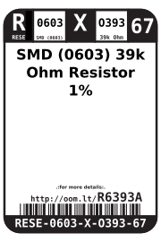
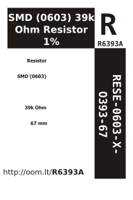

Contents
========

* [RESE-0603-X-O393-67>SMD (0603) 39k Ohm Resistor 1%](#rese-0603-x-o393-67smd-0603-39k-ohm-resistor-1)
	* [Images](#images)
	* [Labels](#labels)
	* [EDA](#eda)
		* [Footprints](#footprints)
		* [Symbols](#symbols)
	* [Tags](#tags)

# RESE-0603-X-O393-67>SMD (0603) 39k Ohm Resistor 1%

- ID: RESE-0603-X-O393-67
- Name: RESE-0603-X-O393-67

## Images
  
  

|image_RE|image_BOTTOM|
| :---: | :---: |
|||

## Labels
  
  

|label-front|label-inventory|label-spec|
| :---: | :---: | :---: |
||||

## EDA

### Footprints
  

|  [eagle/Adafruit-Eagle-Library/adafruit/R0603](https://github.com/oomlout/oomlout_OOMP_eda/tree/main/footprints/eagle/Adafruit-Eagle-Library/adafruit/R0603/)||||
| :---: | :---: | :---: | :---: |

### Symbols

## Tags

- oompID: RESE-0603-X-O393-67
- name: SMD (0603) 39k Ohm Resistor 1%
- hexID: R6393A
- oompType: RESE
- oompSize: 0603
- oompColor: X
- oompDesc: O393
- oompIndex: 67
- oompVersion: 999
- ooWidth: 0.8mm
- ooHeight: 0.45mm
- ooLength: 1.6mm
- oompBbls: template;XXXX-0603-X-XXXX-XX-bbls
- oompDiag: template;XXXX-0603-X-XXXX-XX-diag
- oompIden: template;XXXX-0603-X-XXXX-XX-iden
- oompSchem: template;RESE-XXXX-X-XXXX-XX-schem
- oompSimp: template;XXXX-0603-X-XXXX-XX-simp
- ooDesignator: R1
- footprintEagle: Adafruit-Eagle-Library/adafruit/R0603
- footprintKicad: kicad-footprints/Resistor_SMD/R_0603_1608Metric_Pad0.98x0.95mm_HandSolder
- footprintKicad: kicad-footprints/Resistor_SMD/R_0603_1608Metric
