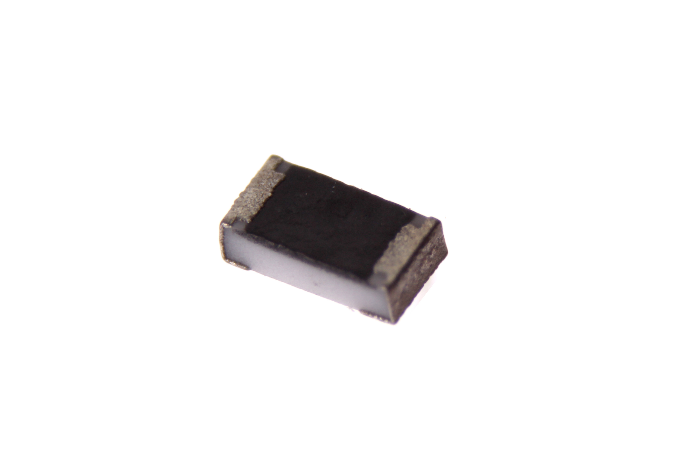
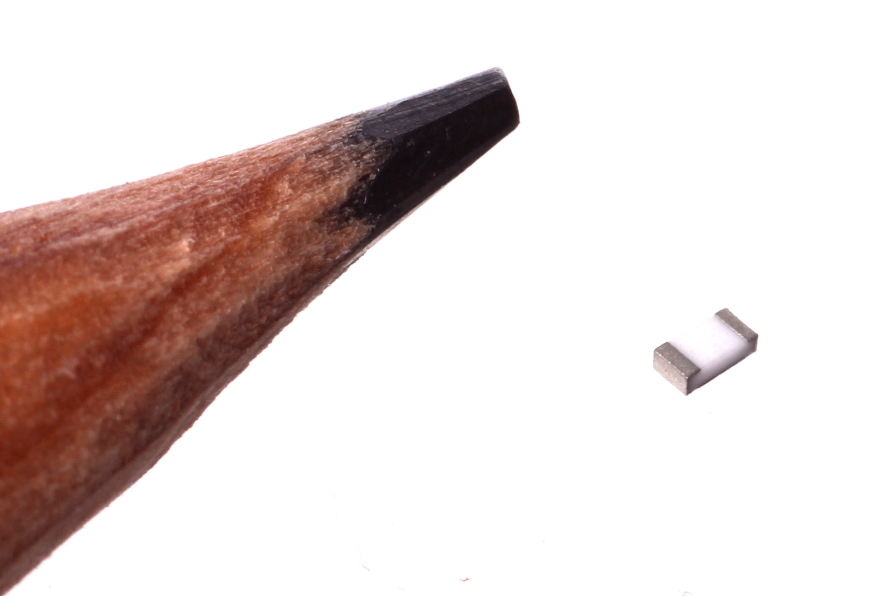

Contents
========

* [RESE-0603-X-O472-01>SMD (0603) 4.7k Ohm Resistor](#rese-0603-x-o472-01smd-0603-47k-ohm-resistor)
	* [Images](#images)
	* [Datasheets](#datasheets)
	* [EDA](#eda)
		* [Footprints](#footprints)
		* [Symbols](#symbols)
	* [Tags](#tags)
  
![][im]
# RESE-0603-X-O472-01>SMD (0603) 4.7k Ohm Resistor

- ID: RESE-0603-X-O472-01
- Name: RESE-0603-X-O472-01

## Images
  
  

|Main|Reference|Bottom|
| :---: | :---: | :---: |
||||

## Datasheets

- Datasheet: [datasheet.pdf](datasheet.pdf)

## EDA

### Footprints
  

|||||
| :---: | :---: | :---: | :---: |

### Symbols

## Tags

- index: 617
- oompID: RESE-0603-X-O472-01
- hexID: R6472
- hexID: R6472
- name: SMD (0603) 4.7k Ohm Resistor
- ooPackageMarking: 472
- oompDesc: O472
- oompSort: 06030004700
- oompType: RESE
- oompSize: 0603
- oompColor: X
- oompIndex: 01
- oompVersion: 999
- ooWidth: 0.8mm
- ooHeight: 0.45mm
- ooLength: 1.6mm
- ooTolerance: 5%
- ooMaterial: Carbon Film
- ooMaxVoltage: 50 V
- oompBbls: template;XXXX-0603-X-XXXX-XX-bbls
- oompDiag: template;XXXX-0603-X-XXXX-XX-diag
- oompIden: template;XXXX-0603-X-XXXX-XX-iden
- oompSchem: template;RESE-XXXX-X-XXXX-XX-schem
- oompSimp: template;XXXX-0603-X-XXXX-XX-simp
- ooDesignator: R1

[im]: image_600.jpg
