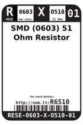
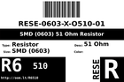
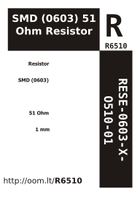

Contents
========

* [R6510 > SMD (0603) 51 Ohm Resistor](#r6510--smd-0603-51-ohm-resistor)
	* [Labels](#labels)
	* [EDA](#eda)
	* [Images](#images)
	* [Tags](#tags)

# R6510 > SMD (0603) 51 Ohm Resistor

- ID: RESE-0603-X-O510-01
- Hex ID: R6510
- Name: SMD (0603) 51 Ohm Resistor
- Description: SMD (0603) 51 Ohm Resistor
- Long Link: [http://oom.lt/RESE-0603-X-O510-01](http://oom.lt/RESE-0603-X-O510-01)
- Short Link: [http://oom.lt/R6510](http://oom.lt/R6510)

## Labels
  
  

|label-front|label-inventory|label-spec|
| :---: | :---: | :---: |
||||

## EDA
  

### Instances
  
Used 41 times.  
Prevalance: (41\10986) 0.3732%  

|Project|Occur- rences|Identifiers|
| :---: | :---: | :---: |
|[PROJ-ADAF-4538-STAN-01 Adafruit NAU7802 PCB](https://github.com/oomlout/oomlout_OOMP_projects/tree/main/PROJ-ADAF-4538-STAN-01/)|[2](https://github.com/oomlout/oomlout_OOMP_projects/tree/main/PROJ-ADAF-4538-STAN-01/)|[R1, R2](https://github.com/oomlout/oomlout_OOMP_projects/tree/main/PROJ-ADAF-4538-STAN-01/)|
|[PROJ-ADAF-5201-STAN-01 Adafruit IS31FL3741 PCB](https://github.com/oomlout/oomlout_OOMP_projects/tree/main/PROJ-ADAF-5201-STAN-01/)|[13](https://github.com/oomlout/oomlout_OOMP_projects/tree/main/PROJ-ADAF-5201-STAN-01/)|[R10, R11, R12, R13, R14, R15, R16, R17, R18, R19, R20, R21, R22](https://github.com/oomlout/oomlout_OOMP_projects/tree/main/PROJ-ADAF-5201-STAN-01/)|
|[PROJ-ADAF-5217-STAN-01 Adafruit EyeLights LED Glasses and Driver PCB](https://github.com/oomlout/oomlout_OOMP_projects/tree/main/PROJ-ADAF-5217-STAN-01/)|[26](https://github.com/oomlout/oomlout_OOMP_projects/tree/main/PROJ-ADAF-5217-STAN-01/)|[R2, R3, R5, R6, R9, R11, R12, R14, R15, R17, R18, R20, R21, R23, R24, R26, R28, R29, R31, R32, R34, R35, R37, R38, R40, R41](https://github.com/oomlout/oomlout_OOMP_projects/tree/main/PROJ-ADAF-5217-STAN-01/)|

## Images
  
  

|image_RE|image_BOTTOM|label-front|label-inventory|label-spec|
| :---: | :---: | :---: | :---: | :---: |
||||||

## Tags

- oompID: RESE-0603-X-O510-01
- name: SMD (0603) 51 Ohm Resistor
- hexID: R6510
- ooPackageMarking: 510
- oompDesc: O510
- oompType: RESE
- oompSize: 0603
- oompColor: X
- oompIndex: 01
- oompVersion: 999
- ooWidth: 0.8mm
- ooHeight: 0.45mm
- ooLength: 1.6mm
- oompBbls: template;XXXX-0603-X-XXXX-XX-bbls
- oompDiag: template;XXXX-0603-X-XXXX-XX-diag
- oompIden: template;XXXX-0603-X-XXXX-XX-iden
- oompSchem: template;RESE-XXXX-X-XXXX-XX-schem
- oompSimp: template;XXXX-0603-X-XXXX-XX-simp
- ooDesignator: R1
- oompInstances: {'PROJECT': 'PROJ-ADAF-4538-STAN-01', 'ID': 'R1'}
- oompInstances: {'PROJECT': 'PROJ-ADAF-4538-STAN-01', 'ID': 'R2'}
- oompInstances: {'PROJECT': 'PROJ-ADAF-5201-STAN-01', 'ID': 'R10'}
- oompInstances: {'PROJECT': 'PROJ-ADAF-5201-STAN-01', 'ID': 'R11'}
- oompInstances: {'PROJECT': 'PROJ-ADAF-5201-STAN-01', 'ID': 'R12'}
- oompInstances: {'PROJECT': 'PROJ-ADAF-5201-STAN-01', 'ID': 'R13'}
- oompInstances: {'PROJECT': 'PROJ-ADAF-5201-STAN-01', 'ID': 'R14'}
- oompInstances: {'PROJECT': 'PROJ-ADAF-5201-STAN-01', 'ID': 'R15'}
- oompInstances: {'PROJECT': 'PROJ-ADAF-5201-STAN-01', 'ID': 'R16'}
- oompInstances: {'PROJECT': 'PROJ-ADAF-5201-STAN-01', 'ID': 'R17'}
- oompInstances: {'PROJECT': 'PROJ-ADAF-5201-STAN-01', 'ID': 'R18'}
- oompInstances: {'PROJECT': 'PROJ-ADAF-5201-STAN-01', 'ID': 'R19'}
- oompInstances: {'PROJECT': 'PROJ-ADAF-5201-STAN-01', 'ID': 'R20'}
- oompInstances: {'PROJECT': 'PROJ-ADAF-5201-STAN-01', 'ID': 'R21'}
- oompInstances: {'PROJECT': 'PROJ-ADAF-5201-STAN-01', 'ID': 'R22'}
- oompInstances: {'PROJECT': 'PROJ-ADAF-5217-STAN-01', 'ID': 'R2'}
- oompInstances: {'PROJECT': 'PROJ-ADAF-5217-STAN-01', 'ID': 'R3'}
- oompInstances: {'PROJECT': 'PROJ-ADAF-5217-STAN-01', 'ID': 'R5'}
- oompInstances: {'PROJECT': 'PROJ-ADAF-5217-STAN-01', 'ID': 'R6'}
- oompInstances: {'PROJECT': 'PROJ-ADAF-5217-STAN-01', 'ID': 'R9'}
- oompInstances: {'PROJECT': 'PROJ-ADAF-5217-STAN-01', 'ID': 'R11'}
- oompInstances: {'PROJECT': 'PROJ-ADAF-5217-STAN-01', 'ID': 'R12'}
- oompInstances: {'PROJECT': 'PROJ-ADAF-5217-STAN-01', 'ID': 'R14'}
- oompInstances: {'PROJECT': 'PROJ-ADAF-5217-STAN-01', 'ID': 'R15'}
- oompInstances: {'PROJECT': 'PROJ-ADAF-5217-STAN-01', 'ID': 'R17'}
- oompInstances: {'PROJECT': 'PROJ-ADAF-5217-STAN-01', 'ID': 'R18'}
- oompInstances: {'PROJECT': 'PROJ-ADAF-5217-STAN-01', 'ID': 'R20'}
- oompInstances: {'PROJECT': 'PROJ-ADAF-5217-STAN-01', 'ID': 'R21'}
- oompInstances: {'PROJECT': 'PROJ-ADAF-5217-STAN-01', 'ID': 'R23'}
- oompInstances: {'PROJECT': 'PROJ-ADAF-5217-STAN-01', 'ID': 'R24'}
- oompInstances: {'PROJECT': 'PROJ-ADAF-5217-STAN-01', 'ID': 'R26'}
- oompInstances: {'PROJECT': 'PROJ-ADAF-5217-STAN-01', 'ID': 'R28'}
- oompInstances: {'PROJECT': 'PROJ-ADAF-5217-STAN-01', 'ID': 'R29'}
- oompInstances: {'PROJECT': 'PROJ-ADAF-5217-STAN-01', 'ID': 'R31'}
- oompInstances: {'PROJECT': 'PROJ-ADAF-5217-STAN-01', 'ID': 'R32'}
- oompInstances: {'PROJECT': 'PROJ-ADAF-5217-STAN-01', 'ID': 'R34'}
- oompInstances: {'PROJECT': 'PROJ-ADAF-5217-STAN-01', 'ID': 'R35'}
- oompInstances: {'PROJECT': 'PROJ-ADAF-5217-STAN-01', 'ID': 'R37'}
- oompInstances: {'PROJECT': 'PROJ-ADAF-5217-STAN-01', 'ID': 'R38'}
- oompInstances: {'PROJECT': 'PROJ-ADAF-5217-STAN-01', 'ID': 'R40'}
- oompInstances: {'PROJECT': 'PROJ-ADAF-5217-STAN-01', 'ID': 'R41'}
