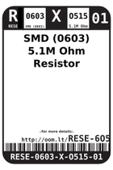
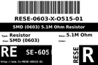
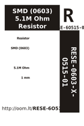

Contents
========

* [RESE-6O515-01 > SMD (0603) 5.1M Ohm Resistor](#rese-6o515-01--smd-0603-51m-ohm-resistor)
	* [Labels](#labels)
	* [EDA](#eda)
	* [Images](#images)
	* [Tags](#tags)

# RESE-6O515-01 > SMD (0603) 5.1M Ohm Resistor

- ID: RESE-0603-X-O515-01
- Hex ID: RESE-6O515-01
- Name: SMD (0603) 5.1M Ohm Resistor
- Description: SMD (0603) 5.1M Ohm Resistor
- Long Link: [http://oom.lt/RESE-0603-X-O515-01](http://oom.lt/RESE-0603-X-O515-01)
- Short Link: [http://oom.lt/RESE-6O515-01](http://oom.lt/RESE-6O515-01)

## Labels
  
  

|label-front|label-inventory|label-spec|
| :---: | :---: | :---: |
||||

## EDA

### Footprints
  

|[  FOOTPRINT-kicad-kicad-footprints-Resistor_SMD-R_0603_1608Metric](https://github.com/oomlout/oomlout_OOMP_eda/tree/main/FOOTPRINT/kicad/kicad-footprints/Resistor_SMD/R_0603_1608Metric/)|[  FOOTPRINT-kicad-kicad-footprints-Resistor_SMD-R_0603_1608Metric_Pad0.98x0.95mm_HandSolder](https://github.com/oomlout/oomlout_OOMP_eda/tree/main/FOOTPRINT/kicad/kicad-footprints/Resistor_SMD/R_0603_1608Metric_Pad0.98x0.95mm_HandSolder/)|||
| :---: | :---: | :---: | :---: |

### Symbols
  

|[  SYMBOL-kicad-kicad-symbols-Device-R](https://github.com/oomlout/oomlout_OOMP_eda/tree/main/SYMBOL/kicad/kicad-symbols/Device/R/)||||
| :---: | :---: | :---: | :---: |

## Images
  
  

|label-front|label-inventory|label-spec|
| :---: | :---: | :---: |
||||

## Tags

- oompType: RESE
- oompSize: 0603
- oompColor: X
- oompDesc: O515
- oompIndex: 01
- oplPartNumber: {'code': 'C-JLCC', 'name': 'JLC Parts Library', 'partID': 'C13320', 'desc': '100mW Thick Film Resistors 75V ??100ppm/?? ??1% -55??~+155?? 5.1M?? 0603  Chip Resistor - Surface Mount ROHS'}
- distributorPartNumber: {'code': 'C-LCSC', 'name': 'LCSC', 'partID': 'C13320'}
- manufacturerPartNumber: {'code': 'C-XXXX', 'name': 'UNI-ROYAL(Uniroyal Elec)', 'partID': '0603WAF5104T5E'}
- hexID: RESE-6O515-01
- oompID: RESE-0603-X-O515-01
- footprintKicad: FOOTPRINT-kicad-kicad-footprints-Resistor_SMD-R_0603_1608Metric
- footprintKicad: FOOTPRINT-kicad-kicad-footprints-Resistor_SMD-R_0603_1608Metric_Pad0.98x0.95mm_HandSolder
- symbolKicad: SYMBOL-kicad-kicad-symbols-Device-R
