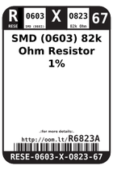
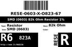
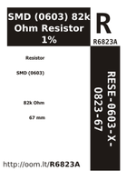
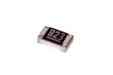

Contents
========

* [R6823A > SMD (0603) 82k Ohm Resistor 1%](#r6823a--smd-0603-82k-ohm-resistor-1)
	* [Datasheets](#datasheets)
	* [Labels](#labels)
	* [EDA](#eda)
	* [Images](#images)
	* [Tags](#tags)
  
![][im]
# R6823A > SMD (0603) 82k Ohm Resistor 1%

- ID: RESE-0603-X-O823-67
- Hex ID: R6823A
- Name: SMD (0603) 82k Ohm Resistor 1%
- Description: SMD (0603) 82k Ohm Resistor 1%
- Long Link: [http://oom.lt/RESE-0603-X-O823-67](http://oom.lt/RESE-0603-X-O823-67)
- Short Link: [http://oom.lt/R6823A](http://oom.lt/R6823A)

## Datasheets

- Datasheet: [datasheet.pdf](datasheet.pdf)

## Labels
  
  

|label-front|label-inventory|label-spec|
| :---: | :---: | :---: |
||||

## EDA

## Images
  
  

|image|image_RE|image_BOTTOM|label-front|label-inventory|label-spec|
| :---: | :---: | :---: | :---: | :---: | :---: |
|||||||

## Tags

- oompID: RESE-0603-X-O823-67
- name: SMD (0603) 82k Ohm Resistor 1%
- hexID: R6823A
- oompSort: 
- oompClass: Surface Mount
- oompClassCode: SMDS
- oompType: RESE
- oompSize: 0603
- oompColor: X
- oompDesc: O823
- oompIndex: 67
- oompVersion: 40
- oompBbls: template;XXXX-0603-X-XXXX-XX-bbls
- oompDiag: template;XXXX-0603-X-XXXX-XX-diag
- oompIden: template;XXXX-0603-X-XXXX-XX-iden
- oompSchem: template;RESE-XXXX-X-XXXX-XX-schem
- oompSimp: template;XXXX-0603-X-XXXX-XX-simp
- ooDesignator: R1

[im]: image_450.jpg
