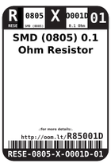
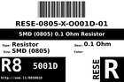
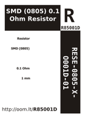
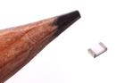

Contents
========

* [R85001D > SMD (0805) 0.1 Ohm Resistor](#r85001d--smd-0805-01-ohm-resistor)
	* [Datasheets](#datasheets)
	* [Labels](#labels)
	* [EDA](#eda)
	* [Images](#images)
	* [Tags](#tags)
  
![][im]
# R85001D > SMD (0805) 0.1 Ohm Resistor

- ID: RESE-0805-X-O001D-01
- Hex ID: R85001D
- Name: SMD (0805) 0.1 Ohm Resistor
- Description: SMD (0805) 0.1 Ohm Resistor
- Long Link: [http://oom.lt/RESE-0805-X-O001D-01](http://oom.lt/RESE-0805-X-O001D-01)
- Long Link: [http://oom.lt/R85001D](http://oom.lt/R85001D)

## Datasheets

- Datasheet: [datasheet.pdf](datasheet.pdf)

## Labels
  
  

|label-front|label-inventory|label-spec|
| :---: | :---: | :---: |
||||

## EDA

### Symbols

## Images
  
  

|image|image_RE|image_BOTTOM|label-front|label-inventory|label-spec|
| :---: | :---: | :---: | :---: | :---: | :---: |
|||||||

## Tags

- oompID: RESE-0805-X-O001D-01
- name: SMD (0805) 0.1 Ohm Resistor
- hexID: R85001D
- oompSort: RESE0805O001D
- oompType: RESE
- oompSize: 0805
- oompColor: X
- oompDesc: O001D
- oompIndex: 01
- oompVersion: 98
- ooWidth: 1.25 mm
- ooLength: 2.0 mm
- ooNumPins: 2
- oompBbls: template;XXXX-0805-X-XXXX-XX-bbls
- oompDiag: template;XXXX-0805-X-XXXX-XX-diag
- oompIden: template;XXXX-0805-X-XXXX-XX-iden
- oompSchem: template;RESE-XXXX-X-XXXX-XX-schem
- oompSimp: template;XXXX-0805-X-XXXX-XX-simp
- ooPackageMarking: R100
- ooDesignator: R1

[im]: image_450.jpg
