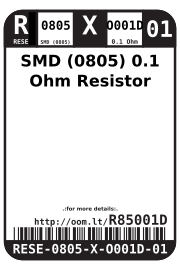
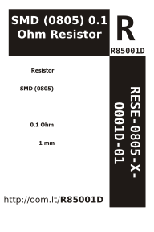

Contents
========

* [RESE-0805-X-O001D-01>SMD (0805) 0.1 Ohm Resistor](#rese-0805-x-o001d-01smd-0805-01-ohm-resistor)
	* [Images](#images)
	* [Datasheets](#datasheets)
	* [Labels](#labels)
	* [EDA](#eda)
		* [Symbols](#symbols)
	* [Tags](#tags)
  
![][im]
# RESE-0805-X-O001D-01>SMD (0805) 0.1 Ohm Resistor

- ID: RESE-0805-X-O001D-01
- Name: RESE-0805-X-O001D-01

## Images
  
  

|Main|Reference|Bottom|
| :---: | :---: | :---: |
||||

## Datasheets

- Datasheet: [datasheet.pdf](datasheet.pdf)

## Labels
  
  

|Front|Inventory|Specifications|
| :---: | :---: | :---: |
||||

## EDA

### Symbols

## Tags

- hexID: R85001D
- oompSort: RESE0805O001D
- oompType: RESE
- oompSize: 0805
- oompColor: X
- oompDesc: O001D
- oompIndex: 01
- oompVersion: 98
- ooWidth: 1.25 mm
- ooLength: 2.0 mm
- ooNumPins: 2
- oompBbls: template;XXXX-0805-X-XXXX-XX-bbls
- oompDiag: template;XXXX-0805-X-XXXX-XX-diag
- oompIden: template;XXXX-0805-X-XXXX-XX-iden
- oompSchem: template;RESE-XXXX-X-XXXX-XX-schem
- oompSimp: template;XXXX-0805-X-XXXX-XX-simp
- ooPackageMarking: R100
- ooDesignator: R1

[im]: image_600.jpg
