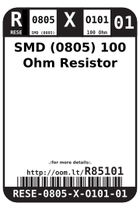
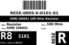
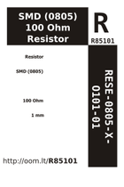

Contents
========

* [R85101 > SMD (0805) 100 Ohm Resistor](#r85101--smd-0805-100-ohm-resistor)
	* [Datasheets](#datasheets)
	* [Labels](#labels)
	* [EDA](#eda)
	* [Images](#images)
	* [Tags](#tags)
  
![][im]
# R85101 > SMD (0805) 100 Ohm Resistor

- ID: RESE-0805-X-O101-01
- Hex ID: R85101
- Name: SMD (0805) 100 Ohm Resistor
- Description: SMD (0805) 100 Ohm Resistor
- Long Link: [http://oom.lt/RESE-0805-X-O101-01](http://oom.lt/RESE-0805-X-O101-01)
- Short Link: [http://oom.lt/R85101](http://oom.lt/R85101)

## Datasheets

- Datasheet: [datasheet.pdf](datasheet.pdf)

## Labels
  
  

|label-front|label-inventory|label-spec|
| :---: | :---: | :---: |
||||

## EDA

### Instances
  
  
Used 34 times.  
Prevalance: (34\9905) 0.3433%  

|OOMP Instances|
| :---: |
|[PROJ-ADAF-1381-STAN-01  Adafruit VS1053 Breakout PCB  Used 2 times. R6, R7](https://github.com/oomlout/oomlout_OOMP_projects/tree/main/PROJ-ADAF-1381-STAN-01/)|
|[PROJ-ADAF-1601-STAN-01  Adafruit PiTFT 2.8 inch Display PCB  Used 4 times. R1, R2, R3, R4](https://github.com/oomlout/oomlout_OOMP_projects/tree/main/PROJ-ADAF-1601-STAN-01/)|
|[PROJ-ADAF-1778-STAN-01  Adafruit AD8495 Breakout PCB  Used 2 times. R1, R2](https://github.com/oomlout/oomlout_OOMP_projects/tree/main/PROJ-ADAF-1778-STAN-01/)|
|[PROJ-ADAF-1788-STAN-01  Adafruit Music Maker MP3 Shield PCB  Used 2 times. R6, R7](https://github.com/oomlout/oomlout_OOMP_projects/tree/main/PROJ-ADAF-1788-STAN-01/)|
|[PROJ-ADAF-2130-STAN-01  Adafruit PAM8302 Mono Amplifier PCB  Used 2 times. R1, R2](https://github.com/oomlout/oomlout_OOMP_projects/tree/main/PROJ-ADAF-2130-STAN-01/)|
|[PROJ-ADAF-2298-STAN-01  Adafruit PiTFT Plus 2.8 PCB  Used 4 times. R1, R2, R3, R4](https://github.com/oomlout/oomlout_OOMP_projects/tree/main/PROJ-ADAF-2298-STAN-01/)|
|[PROJ-ADAF-2315-STAN-01  Adafruit PiTFT 2.2 Inch HAT PCB  Used 4 times. R4, R5, R7, R8](https://github.com/oomlout/oomlout_OOMP_projects/tree/main/PROJ-ADAF-2315-STAN-01/)|
|[PROJ-ADAF-2455-STAN-01  Adafruit PiTFT 2.4 Inch HAT PCB  Used 4 times. R1, R2, R3, R4](https://github.com/oomlout/oomlout_OOMP_projects/tree/main/PROJ-ADAF-2455-STAN-01/)|
|[PROJ-ADAF-2616-STAN-01  Adafruit PiTFT Plus 3.2 PCB  Used 6 times. R1, R2, R15, R16, R17, R18](https://github.com/oomlout/oomlout_OOMP_projects/tree/main/PROJ-ADAF-2616-STAN-01/)|
|[PROJ-ADAF-3263-STAN-01  Adafruit MAX31856 PCB  Used 2 times. R1, R2](https://github.com/oomlout/oomlout_OOMP_projects/tree/main/PROJ-ADAF-3263-STAN-01/)|
|[PROJ-ADAF-3678-STAN-01  Adafruit UDA1334A I2S Stereo DAC PCB  Used 2 times. R4, R6](https://github.com/oomlout/oomlout_OOMP_projects/tree/main/PROJ-ADAF-3678-STAN-01/)|

### Symbols

## Images
  
  

|image|image_RE|image_BOTTOM|label-front|label-inventory|label-spec|
| :---: | :---: | :---: | :---: | :---: | :---: |
|||||||

## Tags

- oompID: RESE-0805-X-O101-01
- hexID: R85101
- ooPackageMarking: 101
- oompDesc: O101
- name: SMD (0805) 100 Ohm Resistor
- oompType: RESE
- oompSize: 0805
- oompColor: X
- oompIndex: 01
- oompVersion: 999
- ooWidth: 1.25mm
- ooHeight: 0.5mm
- ooLength: 2mm
- oompBbls: template;XXXX-0805-X-XXXX-XX-bbls
- oompDiag: template;XXXX-0805-X-XXXX-XX-diag
- oompIden: template;XXXX-0805-X-XXXX-XX-iden
- oompSchem: template;RESE-XXXX-X-XXXX-XX-schem
- oompSimp: template;XXXX-0805-X-XXXX-XX-simp
- ooDesignator: R1
- oompInstances: {'PROJECT': 'PROJ-ADAF-1381-STAN-01', 'ID': 'R6'}
- oompInstances: {'PROJECT': 'PROJ-ADAF-1381-STAN-01', 'ID': 'R7'}
- oompInstances: {'PROJECT': 'PROJ-ADAF-1601-STAN-01', 'ID': 'R1'}
- oompInstances: {'PROJECT': 'PROJ-ADAF-1601-STAN-01', 'ID': 'R2'}
- oompInstances: {'PROJECT': 'PROJ-ADAF-1601-STAN-01', 'ID': 'R3'}
- oompInstances: {'PROJECT': 'PROJ-ADAF-1601-STAN-01', 'ID': 'R4'}
- oompInstances: {'PROJECT': 'PROJ-ADAF-1778-STAN-01', 'ID': 'R1'}
- oompInstances: {'PROJECT': 'PROJ-ADAF-1778-STAN-01', 'ID': 'R2'}
- oompInstances: {'PROJECT': 'PROJ-ADAF-1788-STAN-01', 'ID': 'R6'}
- oompInstances: {'PROJECT': 'PROJ-ADAF-1788-STAN-01', 'ID': 'R7'}
- oompInstances: {'PROJECT': 'PROJ-ADAF-2130-STAN-01', 'ID': 'R1'}
- oompInstances: {'PROJECT': 'PROJ-ADAF-2130-STAN-01', 'ID': 'R2'}
- oompInstances: {'PROJECT': 'PROJ-ADAF-2298-STAN-01', 'ID': 'R1'}
- oompInstances: {'PROJECT': 'PROJ-ADAF-2298-STAN-01', 'ID': 'R2'}
- oompInstances: {'PROJECT': 'PROJ-ADAF-2298-STAN-01', 'ID': 'R3'}
- oompInstances: {'PROJECT': 'PROJ-ADAF-2298-STAN-01', 'ID': 'R4'}
- oompInstances: {'PROJECT': 'PROJ-ADAF-2315-STAN-01', 'ID': 'R4'}
- oompInstances: {'PROJECT': 'PROJ-ADAF-2315-STAN-01', 'ID': 'R5'}
- oompInstances: {'PROJECT': 'PROJ-ADAF-2315-STAN-01', 'ID': 'R7'}
- oompInstances: {'PROJECT': 'PROJ-ADAF-2315-STAN-01', 'ID': 'R8'}
- oompInstances: {'PROJECT': 'PROJ-ADAF-2455-STAN-01', 'ID': 'R1'}
- oompInstances: {'PROJECT': 'PROJ-ADAF-2455-STAN-01', 'ID': 'R2'}
- oompInstances: {'PROJECT': 'PROJ-ADAF-2455-STAN-01', 'ID': 'R3'}
- oompInstances: {'PROJECT': 'PROJ-ADAF-2455-STAN-01', 'ID': 'R4'}
- oompInstances: {'PROJECT': 'PROJ-ADAF-2616-STAN-01', 'ID': 'R1'}
- oompInstances: {'PROJECT': 'PROJ-ADAF-2616-STAN-01', 'ID': 'R2'}
- oompInstances: {'PROJECT': 'PROJ-ADAF-2616-STAN-01', 'ID': 'R15'}
- oompInstances: {'PROJECT': 'PROJ-ADAF-2616-STAN-01', 'ID': 'R16'}
- oompInstances: {'PROJECT': 'PROJ-ADAF-2616-STAN-01', 'ID': 'R17'}
- oompInstances: {'PROJECT': 'PROJ-ADAF-2616-STAN-01', 'ID': 'R18'}
- oompInstances: {'PROJECT': 'PROJ-ADAF-3263-STAN-01', 'ID': 'R1'}
- oompInstances: {'PROJECT': 'PROJ-ADAF-3263-STAN-01', 'ID': 'R2'}
- oompInstances: {'PROJECT': 'PROJ-ADAF-3678-STAN-01', 'ID': 'R4'}
- oompInstances: {'PROJECT': 'PROJ-ADAF-3678-STAN-01', 'ID': 'R6'}

[im]: image_450.jpg
