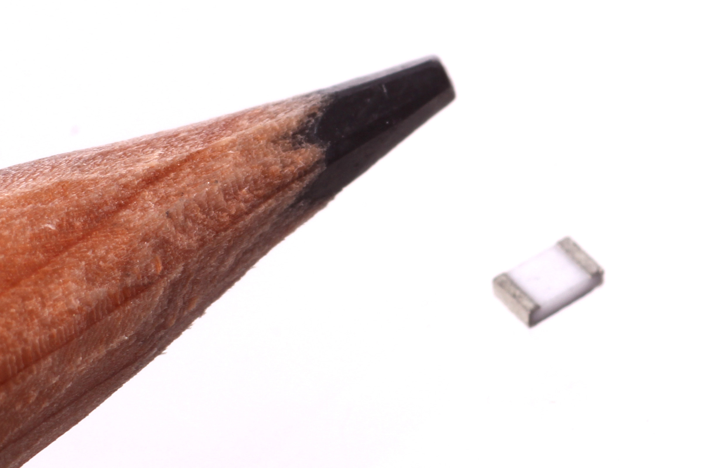
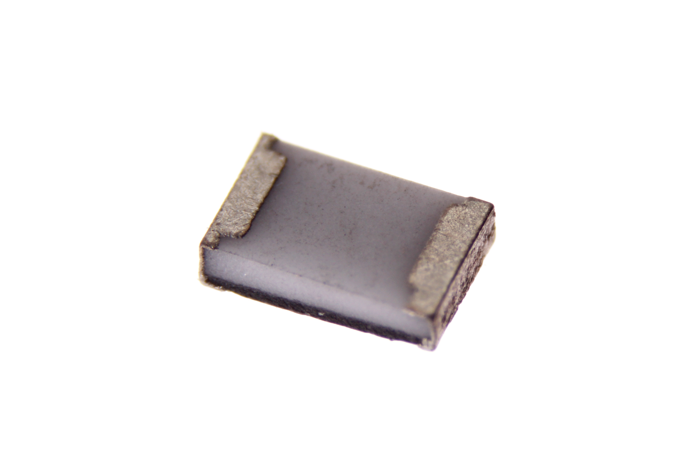
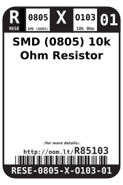
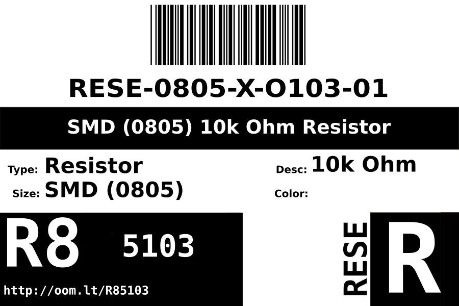
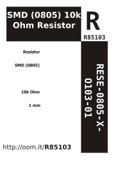

Contents
========

* [RESE-0805-X-O103-01>SMD (0805) 10k Ohm Resistor](#rese-0805-x-o103-01smd-0805-10k-ohm-resistor)
	* [Images](#images)
	* [Datasheets](#datasheets)
	* [Labels](#labels)
	* [EDA](#eda)
		* [Symbols](#symbols)
	* [Tags](#tags)

# RESE-0805-X-O103-01>SMD (0805) 10k Ohm Resistor

- ID: RESE-0805-X-O103-01
- Name: RESE-0805-X-O103-01

## Images
  
  

|Reference|Bottom|
| :---: | :---: |
|||

## Datasheets

- Datasheet: [datasheet.pdf](datasheet.pdf)

## Labels
  
  

|Front|Inventory|Specifications|
| :---: | :---: | :---: |
||||

## EDA

### Symbols

## Tags

- index: 12964
- oompID: RESE-0805-X-O103-01
- name: SMD (0805) 10k Ohm Resistor
- ooPackageMarking: 103
- hexID: R85103
- oompSort: 
- oompClass: Surface Mount
- oompClassCode: SMDS
- oompType: RESE
- oompSize: 0805
- oompColor: X
- oompDesc: O103
- oompIndex: 01
- oompVersion: 40
- oompBbls: template;XXXX-0805-X-XXXX-XX-bbls
- oompDiag: template;XXXX-0805-X-XXXX-XX-diag
- oompIden: template;XXXX-0805-X-XXXX-XX-iden
- oompSchem: template;RESE-XXXX-X-XXXX-XX-schem
- oompSimp: template;XXXX-0805-X-XXXX-XX-simp
- ooDesignator: R1
