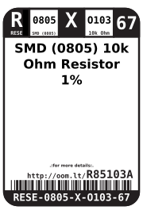
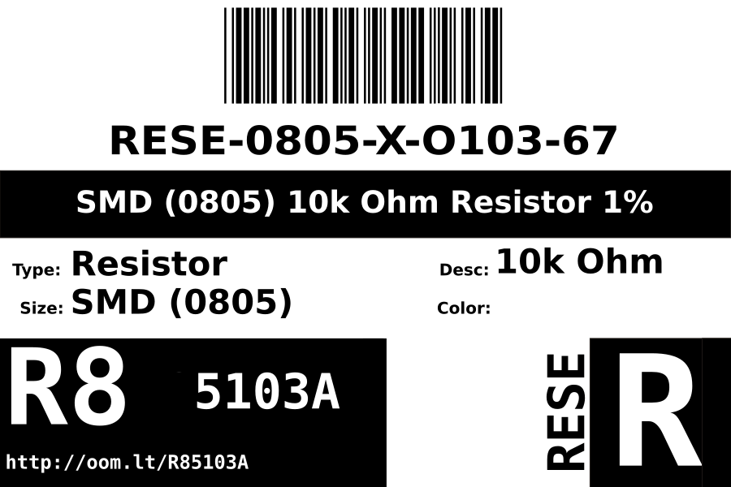
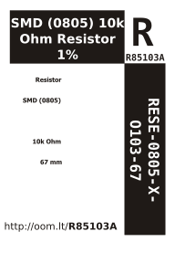

Contents
========

* [RESE-0805-X-O103-67>SMD (0805) 10k Ohm Resistor 1%](#rese-0805-x-o103-67smd-0805-10k-ohm-resistor-1)
	* [Images](#images)
	* [Datasheets](#datasheets)
	* [Labels](#labels)
	* [EDA](#eda)
		* [Symbols](#symbols)
	* [Tags](#tags)
  
![][im]
# RESE-0805-X-O103-67>SMD (0805) 10k Ohm Resistor 1%

- ID: RESE-0805-X-O103-67
- Name: RESE-0805-X-O103-67

## Images
  
  

|Main|Reference|Bottom|
| :---: | :---: | :---: |
||||

## Datasheets

- Datasheet: [datasheet.pdf](datasheet.pdf)

## Labels
  
  

|Front|Inventory|Specifications|
| :---: | :---: | :---: |
||||

## EDA

### Symbols

## Tags

- hexID: R85103A
- oompDesc: O103
- oompType: RESE
- oompSize: 0805
- oompColor: X
- oompIndex: 67
- oompVersion: 999
- ooWidth: 1.25mm
- ooHeight: 0.5mm
- ooLength: 2mm
- oompBbls: template;XXXX-0805-X-XXXX-XX-bbls
- oompDiag: template;XXXX-0805-X-XXXX-XX-diag
- oompIden: template;XXXX-0805-X-XXXX-XX-iden
- oompSchem: template;RESE-XXXX-X-XXXX-XX-schem
- oompSimp: template;XXXX-0805-X-XXXX-XX-simp
- ooDesignator: R1

[im]: image_600.jpg
