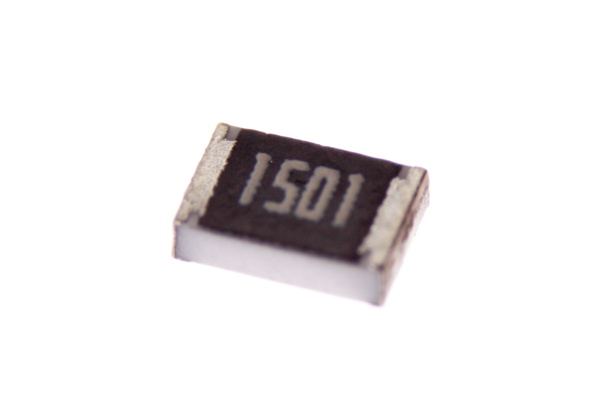
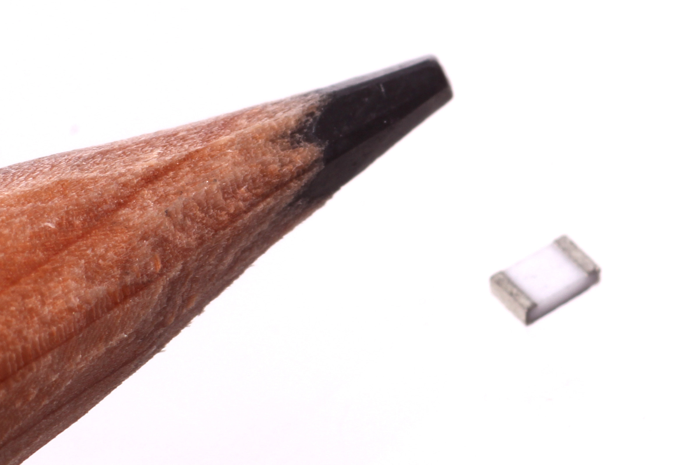
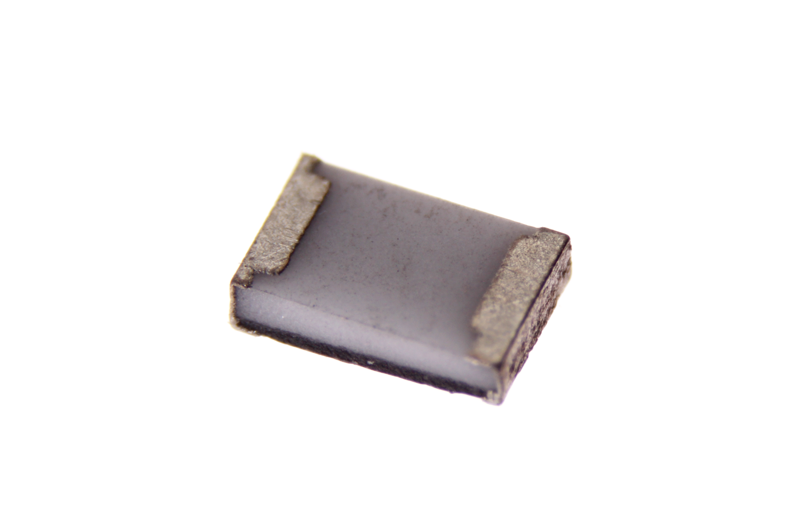

Contents
========

* [RESE-0805-X-O152-67>SMD (0805) 1.5k Ohm Resistor 1%](#rese-0805-x-o152-67smd-0805-15k-ohm-resistor-1)
	* [Images](#images)
	* [Datasheets](#datasheets)
	* [EDA](#eda)
		* [Footprints](#footprints)
		* [Symbols](#symbols)
	* [Tags](#tags)

# RESE-0805-X-O152-67>SMD (0805) 1.5k Ohm Resistor 1%

- ID: RESE-0805-X-O152-67
- Name: RESE-0805-X-O152-67

## Images
  
  

|Main|Reference|Bottom|
| :---: | :---: | :---: |
||||

## Datasheets

- Datasheet: [datasheet.pdf](datasheet.pdf)

## EDA

### Footprints
  

|||||
| :---: | :---: | :---: | :---: |

### Symbols

## Tags

- index: 677
- oompID: RESE-0805-X-O152-67
- hexID: R85152A
- oompDesc: O152
- name: SMD (0805) 1.5k Ohm Resistor 1%
- oompType: RESE
- oompSize: 0805
- oompColor: X
- oompIndex: 67
- oompVersion: 999
- ooWidth: 1.25mm
- ooHeight: 0.5mm
- ooLength: 2mm
- oompBbls: template;XXXX-0805-X-XXXX-XX-bbls
- oompDiag: template;XXXX-0805-X-XXXX-XX-diag
- oompIden: template;XXXX-0805-X-XXXX-XX-iden
- oompSchem: template;RESE-XXXX-X-XXXX-XX-schem
- oompSimp: template;XXXX-0805-X-XXXX-XX-simp
- ooDesignator: R1
