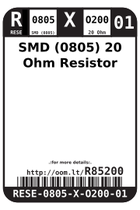

Contents
========

* [R85200 > SMD (0805) 20 Ohm Resistor](#r85200--smd-0805-20-ohm-resistor)
	* [Labels](#labels)
	* [EDA](#eda)
	* [Images](#images)
	* [Tags](#tags)

# R85200 > SMD (0805) 20 Ohm Resistor

- ID: RESE-0805-X-O200-01
- Hex ID: R85200
- Name: SMD (0805) 20 Ohm Resistor
- Description: SMD (0805) 20 Ohm Resistor
- Long Link: [http://oom.lt/RESE-0805-X-O200-01](http://oom.lt/RESE-0805-X-O200-01)
- Short Link: [http://oom.lt/R85200](http://oom.lt/R85200)

## Labels
  
  

|label-front|label-inventory|label-spec|
| :---: | :---: | :---: |
||||

## EDA

### Instances
  
  
Used 2 times.  
Prevalance: (2\9905) 0.0202%  

|OOMP Instances|
| :---: |
|[PROJ-ADAF-1381-STAN-01  Adafruit VS1053 Breakout PCB  Used 2 times. R3, R4](https://github.com/oomlout/oomlout_OOMP_projects/tree/main/PROJ-ADAF-1381-STAN-01/)|

### Symbols

## Images
  
  

|label-front|label-inventory|label-spec|
| :---: | :---: | :---: |
||||

## Tags

- oompID: RESE-0805-X-O200-01
- name: SMD (0805) 20 Ohm Resistor
- hexID: R85200
- ooPackageMarking: 200
- oompDesc: O200
- oompType: RESE
- oompSize: 0805
- oompColor: X
- oompIndex: 01
- oompVersion: 999
- ooWidth: 1.25mm
- ooHeight: 0.5mm
- ooLength: 2mm
- oompBbls: template;XXXX-0805-X-XXXX-XX-bbls
- oompDiag: template;XXXX-0805-X-XXXX-XX-diag
- oompIden: template;XXXX-0805-X-XXXX-XX-iden
- oompSchem: template;RESE-XXXX-X-XXXX-XX-schem
- oompSimp: template;XXXX-0805-X-XXXX-XX-simp
- ooDesignator: R1
- oompInstances: {'PROJECT': 'PROJ-ADAF-1381-STAN-01', 'ID': 'R3'}
- oompInstances: {'PROJECT': 'PROJ-ADAF-1381-STAN-01', 'ID': 'R4'}
