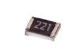

Contents
========

* [R85221 > SMD (0805) 220 Ohm Resistor](#r85221--smd-0805-220-ohm-resistor)
	* [Datasheets](#datasheets)
	* [Labels](#labels)
	* [EDA](#eda)
	* [Images](#images)
	* [Tags](#tags)
  
![][im]
# R85221 > SMD (0805) 220 Ohm Resistor

- ID: RESE-0805-X-O221-01
- Hex ID: R85221
- Name: SMD (0805) 220 Ohm Resistor
- Description: SMD (0805) 220 Ohm Resistor
- Long Link: [http://oom.lt/RESE-0805-X-O221-01](http://oom.lt/RESE-0805-X-O221-01)
- Short Link: [http://oom.lt/R85221](http://oom.lt/R85221)

## Datasheets

- Datasheet: [datasheet.pdf](datasheet.pdf)

## Labels
  
  

|label-front|label-inventory|label-spec|
| :---: | :---: | :---: |
||||

## EDA

### Instances
  
  
Used 21 times.  
Prevalance: (21\9905) 0.212%  

|OOMP Instances|
| :---: |
|[PROJ-ADAF-1588-STAN-01  Adafruit Bluefruit Classic PCBs  Used 2 times. R8, R10](https://github.com/oomlout/oomlout_OOMP_projects/tree/main/PROJ-ADAF-1588-STAN-01/)|
|[PROJ-ADAF-1628-STAN-01  Adafruit Bluefruit EZ Link Shield PCB  Used 2 times. R8, R10](https://github.com/oomlout/oomlout_OOMP_projects/tree/main/PROJ-ADAF-1628-STAN-01/)|
|[PROJ-ADAF-815-STAN-01  Adafruit 16 Channel PWM Servo Driver PCB  Used 17 times. R10, R11, R12, R13, R14, R15, R16, R17, R18, R19, R20, R21, R22, R23, R24, R25, R26](https://github.com/oomlout/oomlout_OOMP_projects/tree/main/PROJ-ADAF-815-STAN-01/)|

### Symbols

## Images
  
  

|image|image_RE|image_BOTTOM|label-front|label-inventory|label-spec|
| :---: | :---: | :---: | :---: | :---: | :---: |
|||||||

## Tags

- oompID: RESE-0805-X-O221-01
- hexID: R85221
- ooPackageMarking: 221
- oompDesc: O221
- name: SMD (0805) 220 Ohm Resistor
- oompType: RESE
- oompSize: 0805
- oompColor: X
- oompIndex: 01
- oompVersion: 999
- ooWidth: 1.25mm
- ooHeight: 0.5mm
- ooLength: 2mm
- oompBbls: template;XXXX-0805-X-XXXX-XX-bbls
- oompDiag: template;XXXX-0805-X-XXXX-XX-diag
- oompIden: template;XXXX-0805-X-XXXX-XX-iden
- oompSchem: template;RESE-XXXX-X-XXXX-XX-schem
- oompSimp: template;XXXX-0805-X-XXXX-XX-simp
- ooDesignator: R1
- oompInstances: {'PROJECT': 'PROJ-ADAF-1588-STAN-01', 'ID': 'R8'}
- oompInstances: {'PROJECT': 'PROJ-ADAF-1588-STAN-01', 'ID': 'R10'}
- oompInstances: {'PROJECT': 'PROJ-ADAF-1628-STAN-01', 'ID': 'R8'}
- oompInstances: {'PROJECT': 'PROJ-ADAF-1628-STAN-01', 'ID': 'R10'}
- oompInstances: {'PROJECT': 'PROJ-ADAF-815-STAN-01', 'ID': 'R10'}
- oompInstances: {'PROJECT': 'PROJ-ADAF-815-STAN-01', 'ID': 'R11'}
- oompInstances: {'PROJECT': 'PROJ-ADAF-815-STAN-01', 'ID': 'R12'}
- oompInstances: {'PROJECT': 'PROJ-ADAF-815-STAN-01', 'ID': 'R13'}
- oompInstances: {'PROJECT': 'PROJ-ADAF-815-STAN-01', 'ID': 'R14'}
- oompInstances: {'PROJECT': 'PROJ-ADAF-815-STAN-01', 'ID': 'R15'}
- oompInstances: {'PROJECT': 'PROJ-ADAF-815-STAN-01', 'ID': 'R16'}
- oompInstances: {'PROJECT': 'PROJ-ADAF-815-STAN-01', 'ID': 'R17'}
- oompInstances: {'PROJECT': 'PROJ-ADAF-815-STAN-01', 'ID': 'R18'}
- oompInstances: {'PROJECT': 'PROJ-ADAF-815-STAN-01', 'ID': 'R19'}
- oompInstances: {'PROJECT': 'PROJ-ADAF-815-STAN-01', 'ID': 'R20'}
- oompInstances: {'PROJECT': 'PROJ-ADAF-815-STAN-01', 'ID': 'R21'}
- oompInstances: {'PROJECT': 'PROJ-ADAF-815-STAN-01', 'ID': 'R22'}
- oompInstances: {'PROJECT': 'PROJ-ADAF-815-STAN-01', 'ID': 'R23'}
- oompInstances: {'PROJECT': 'PROJ-ADAF-815-STAN-01', 'ID': 'R24'}
- oompInstances: {'PROJECT': 'PROJ-ADAF-815-STAN-01', 'ID': 'R25'}
- oompInstances: {'PROJECT': 'PROJ-ADAF-815-STAN-01', 'ID': 'R26'}

[im]: image_450.jpg
