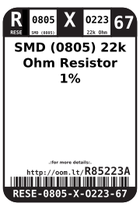
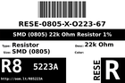
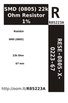

Contents
========

* [R85223A > SMD (0805) 22k Ohm Resistor 1%](#r85223a--smd-0805-22k-ohm-resistor-1)
	* [Labels](#labels)
	* [EDA](#eda)
	* [Images](#images)
	* [Tags](#tags)

# R85223A > SMD (0805) 22k Ohm Resistor 1%

- ID: RESE-0805-X-O223-67
- Hex ID: R85223A
- Name: SMD (0805) 22k Ohm Resistor 1%
- Description: SMD (0805) 22k Ohm Resistor 1%
- Long Link: [http://oom.lt/RESE-0805-X-O223-67](http://oom.lt/RESE-0805-X-O223-67)
- Short Link: [http://oom.lt/R85223A](http://oom.lt/R85223A)

## Labels
  
  

|label-front|label-inventory|label-spec|
| :---: | :---: | :---: |
||||

## EDA

### Symbols

## Images
  
  

|label-front|label-inventory|label-spec|
| :---: | :---: | :---: |
||||

## Tags

- oompID: RESE-0805-X-O223-67
- name: SMD (0805) 22k Ohm Resistor 1%
- hexID: R85223A
- oompDesc: O223
- oompType: RESE
- oompSize: 0805
- oompColor: X
- oompIndex: 67
- oompVersion: 999
- ooWidth: 1.25mm
- ooHeight: 0.5mm
- ooLength: 2mm
- oompBbls: template;XXXX-0805-X-XXXX-XX-bbls
- oompDiag: template;XXXX-0805-X-XXXX-XX-diag
- oompIden: template;XXXX-0805-X-XXXX-XX-iden
- oompSchem: template;RESE-XXXX-X-XXXX-XX-schem
- oompSimp: template;XXXX-0805-X-XXXX-XX-simp
- ooDesignator: R1
