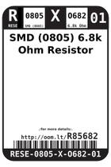
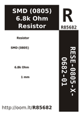

Contents
========

* [R85682 > SMD (0805) 6.8k Ohm Resistor](#r85682--smd-0805-68k-ohm-resistor)
	* [Labels](#labels)
	* [EDA](#eda)
	* [Images](#images)
	* [Tags](#tags)

# R85682 > SMD (0805) 6.8k Ohm Resistor

- ID: RESE-0805-X-O682-01
- Hex ID: R85682
- Name: SMD (0805) 6.8k Ohm Resistor
- Description: SMD (0805) 6.8k Ohm Resistor
- Long Link: [http://oom.lt/RESE-0805-X-O682-01](http://oom.lt/RESE-0805-X-O682-01)
- Long Link: [http://oom.lt/R85682](http://oom.lt/R85682)

## Labels
  
  

|label-front|label-inventory|label-spec|
| :---: | :---: | :---: |
||||

## EDA

### Symbols

## Images
  
  

|label-front|label-inventory|label-spec|
| :---: | :---: | :---: |
||||

## Tags

- oompID: RESE-0805-X-O682-01
- name: SMD (0805) 6.8k Ohm Resistor
- hexID: R85682
- ooPackageMarking: 682
- oompDesc: O682
- oompType: RESE
- oompSize: 0805
- oompColor: X
- oompIndex: 01
- oompVersion: 999
- ooWidth: 1.25mm
- ooHeight: 0.5mm
- ooLength: 2mm
- oompBbls: template;XXXX-0805-X-XXXX-XX-bbls
- oompDiag: template;XXXX-0805-X-XXXX-XX-diag
- oompIden: template;XXXX-0805-X-XXXX-XX-iden
- oompSchem: template;RESE-XXXX-X-XXXX-XX-schem
- oompSimp: template;XXXX-0805-X-XXXX-XX-simp
- ooDesignator: R1
