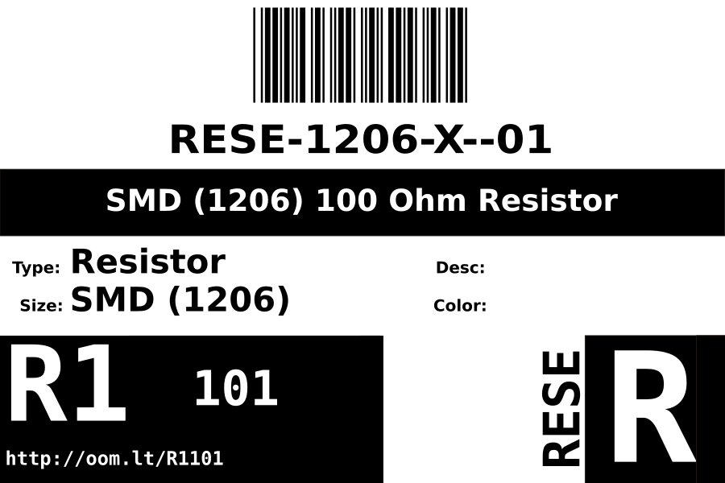

Contents
========

* [RESE-1206-X--01>SMD (1206) 13 Ohm Resistor](#rese-1206-x--01smd-1206-13-ohm-resistor)
	* [Datasheets](#datasheets)
	* [Labels](#labels)
	* [EDA](#eda)
		* [Symbols](#symbols)
	* [Tags](#tags)

# RESE-1206-X--01>SMD (1206) 13 Ohm Resistor

- ID: RESE-1206-X--01
- Name: RESE-1206-X--01

## Datasheets

- Datasheet: [datasheet.pdf](datasheet.pdf)

## Labels
  
  

|Front|Inventory|Specifications|
| :---: | :---: | :---: |
||||

## EDA

### Symbols

## Tags

- index: 13027
- oompID: RESE-1206-X-O130-01
- hexID: R1130
- name: SMD (1206) 13 Ohm Resistor
- oompType: RESE
- oompSize: 1206
- oompColor: X
- oompIndex: 01
- oompVersion: 999
- ooWidth: 1.6mm
- ooHeight: 0.55mm
- ooLength: 3.1mm
- oompDiag: template;XXXX-1206-X-XXXX-XX-diag
- oompIden: template;XXXX-1206-X-XXXX-XX-iden
- oompSchem: template;RESE-XXXX-X-XXXX-XX-schem
- oompSimp: template;XXXX-1206-X-XXXX-XX-simp
- ooDesignator: R1
