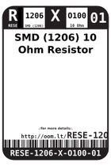
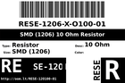
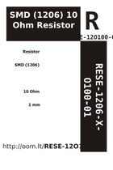

Contents
========

* [R12O100 > SMD (1206) 10 Ohm Resistor](#r12o100--smd-1206-10-ohm-resistor)
	* [Labels](#labels)
	* [EDA](#eda)
	* [Images](#images)
	* [Tags](#tags)

# R12O100 > SMD (1206) 10 Ohm Resistor

- ID: RESE-1206-X-O100-01
- Hex ID: R12O100
- Name: SMD (1206) 10 Ohm Resistor
- Description: SMD (1206) 10 Ohm Resistor
- Long Link: [http://oom.lt/RESE-1206-X-O100-01](http://oom.lt/RESE-1206-X-O100-01)
- Short Link: [http://oom.lt/R12O100](http://oom.lt/R12O100)

## Labels
  
  

|label-front|label-inventory|label-spec|
| :---: | :---: | :---: |
||||

## EDA

### Footprints
  

|[  FOOTPRINT-kicad-kicad-footprints-Resistor_SMD-R_1206_3216Metric](https://github.com/oomlout/oomlout_OOMP_eda/tree/main/FOOTPRINT/kicad/kicad-footprints/Resistor_SMD/R_1206_3216Metric/)|[  FOOTPRINT-kicad-kicad-footprints-Resistor_SMD-R_1206_3216Metric_Pad1.30x1.75mm_HandSolder](https://github.com/oomlout/oomlout_OOMP_eda/tree/main/FOOTPRINT/kicad/kicad-footprints/Resistor_SMD/R_1206_3216Metric_Pad1.30x1.75mm_HandSolder/)|||
| :---: | :---: | :---: | :---: |

### Symbols
  

|[  SYMBOL-kicad-kicad-symbols-Device-R](https://github.com/oomlout/oomlout_OOMP_eda/tree/main/SYMBOL/kicad/kicad-symbols/Device/R/)||||
| :---: | :---: | :---: | :---: |

## Images
  
  

|label-front|label-inventory|label-spec|
| :---: | :---: | :---: |
||||

## Tags

- oompType: RESE
- oompSize: 1206
- oompColor: X
- oompDesc: O100
- oompIndex: 01
- oplPartNumber: {'code': 'C-JLCC', 'name': 'JLC Parts Library', 'partID': 'C17903', 'desc': '250mW Thick Film Resistors 200V ??1% ??400ppm/?? -55??~+155?? 10?? 1206  Chip Resistor - Surface Mount ROHS'}
- distributorPartNumber: {'code': 'C-LCSC', 'name': 'LCSC', 'partID': 'C17903'}
- manufacturerPartNumber: {'code': 'C-XXXX', 'name': 'UNI-ROYAL(Uniroyal Elec)', 'partID': '1206W4F100JT5E'}
- hexID: R12O100
- oompID: RESE-1206-X-O100-01
- symbolKicad: SYMBOL-kicad-kicad-symbols-Device-R
- footprintKicad: FOOTPRINT-kicad-kicad-footprints-Resistor_SMD-R_1206_3216Metric
- footprintKicad: FOOTPRINT-kicad-kicad-footprints-Resistor_SMD-R_1206_3216Metric_Pad1.30x1.75mm_HandSolder
