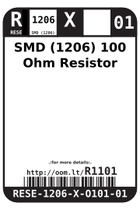
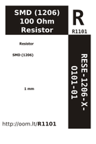
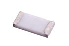

Contents
========

* [R1101 > SMD (1206) 100 Ohm Resistor](#r1101--smd-1206-100-ohm-resistor)
	* [Datasheets](#datasheets)
	* [Labels](#labels)
	* [EDA](#eda)
	* [Images](#images)
	* [Tags](#tags)
  
![][im]
# R1101 > SMD (1206) 100 Ohm Resistor

- ID: RESE-1206-X-O101-01
- Hex ID: R1101
- Name: SMD (1206) 100 Ohm Resistor
- Description: SMD (1206) 100 Ohm Resistor
- Long Link: [http://oom.lt/RESE-1206-X-O101-01](http://oom.lt/RESE-1206-X-O101-01)
- Short Link: [http://oom.lt/R1101](http://oom.lt/R1101)

## Datasheets

- Datasheet: [datasheet.pdf](datasheet.pdf)

## Labels
  
  

|label-front|label-inventory|label-spec|
| :---: | :---: | :---: |
||||

## EDA

## Images
  
  

|image|image_BOTTOM|label-front|label-inventory|label-spec|
| :---: | :---: | :---: | :---: | :---: |
||||||

## Tags

- oompID: RESE-1206-X-O101-01
- hexID: R1101
- name: SMD (1206) 100 Ohm Resistor
- oompSort: 12060000100
- oompType: RESE
- oompSize: 1206
- oompColor: X
- oompIndex: 01
- oompVersion: 999
- ooWidth: 1.6mm
- ooHeight: 0.55mm
- ooLength: 3.1mm
- ooTolerance: 5%
- ooMaterial: Carbon Film
- ooMaxVoltage: 50 V
- oompDiag: template;XXXX-1206-X-XXXX-XX-diag
- oompIden: template;XXXX-1206-X-XXXX-XX-iden
- oompSchem: template;RESE-XXXX-X-XXXX-XX-schem
- oompSimp: template;XXXX-1206-X-XXXX-XX-simp
- ooDesignator: R1

[im]: image_450.jpg
