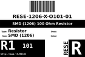

Contents
========

* [RESE-12O101-01 > SMD (1206) 100 Ohm Resistor](#rese-12o101-01--smd-1206-100-ohm-resistor)
	* [Datasheets](#datasheets)
	* [Labels](#labels)
	* [EDA](#eda)
	* [Images](#images)
	* [Tags](#tags)
  
![][im]
# RESE-12O101-01 > SMD (1206) 100 Ohm Resistor

- ID: RESE-1206-X-O101-01
- Hex ID: RESE-12O101-01
- Name: SMD (1206) 100 Ohm Resistor
- Description: SMD (1206) 100 Ohm Resistor
- Long Link: [http://oom.lt/RESE-1206-X-O101-01](http://oom.lt/RESE-1206-X-O101-01)
- Short Link: [http://oom.lt/RESE-12O101-01](http://oom.lt/RESE-12O101-01)

## Datasheets

- Datasheet: [datasheet.pdf](datasheet.pdf)

## Labels
  
  

|label-front|label-inventory|label-spec|
| :---: | :---: | :---: |
||||

## EDA

## Images
  
  

|image|image_BOTTOM|label-front|label-inventory|label-spec|
| :---: | :---: | :---: | :---: | :---: |
||||||

## Tags

- oompType: RESE
- oompSize: 1206
- oompColor: X
- oompDesc: O101
- oompIndex: 01
- oplPartNumber: {'code': 'C-JLCC', 'name': 'JLC Parts Library', 'partID': 'C17901', 'desc': '250mW Thick Film Resistors 200V ??100ppm/?? ??1% -55??~+155?? 100?? 1206  Chip Resistor - Surface Mount ROHS'}
- distributorPartNumber: {'code': 'C-LCSC', 'name': 'LCSC', 'partID': 'C17901'}
- manufacturerPartNumber: {'code': 'C-XXXX', 'name': 'UNI-ROYAL(Uniroyal Elec)', 'partID': '1206W4F1000T5E'}
- hexID: RESE-12O101-01
- oompID: RESE-1206-X-O101-01

[im]: image_450.jpg
