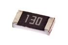

Contents
========

* [R1130 > SMD (1206) 13 Ohm Resistor](#r1130--smd-1206-13-ohm-resistor)
	* [Datasheets](#datasheets)
	* [Labels](#labels)
	* [EDA](#eda)
	* [Images](#images)
	* [Tags](#tags)
  
![][im]
# R1130 > SMD (1206) 13 Ohm Resistor

- ID: RESE-1206-X-O130-01
- Hex ID: R1130
- Name: SMD (1206) 13 Ohm Resistor
- Description: SMD (1206) 13 Ohm Resistor
- Long Link: [http://oom.lt/RESE-1206-X-O130-01](http://oom.lt/RESE-1206-X-O130-01)
- Short Link: [http://oom.lt/R1130](http://oom.lt/R1130)

## Datasheets

- Datasheet: [datasheet.pdf](datasheet.pdf)

## Labels
  
  

|label-front|label-inventory|label-spec|
| :---: | :---: | :---: |
||||

## EDA

### Footprints
  

|[  FOOTPRINT-kicad-kicad-footprints-Resistor_SMD-R_1206_3216Metric](https://github.com/oomlout/oomlout_OOMP_eda/tree/main/FOOTPRINT/kicad/kicad-footprints/Resistor_SMD/R_1206_3216Metric/)|[  FOOTPRINT-kicad-kicad-footprints-Resistor_SMD-R_1206_3216Metric_Pad1.30x1.75mm_HandSolder](https://github.com/oomlout/oomlout_OOMP_eda/tree/main/FOOTPRINT/kicad/kicad-footprints/Resistor_SMD/R_1206_3216Metric_Pad1.30x1.75mm_HandSolder/)|||
| :---: | :---: | :---: | :---: |

### Symbols
  

|[  SYMBOL-kicad-kicad-symbols-Device-R](https://github.com/oomlout/oomlout_OOMP_eda/tree/main/SYMBOL/kicad/kicad-symbols/Device/R/)||||
| :---: | :---: | :---: | :---: |

## Images
  
  

|image|label-front|label-inventory|label-spec|
| :---: | :---: | :---: | :---: |
|||||

## Tags

- oompID: RESE-1206-X-O130-01
- hexID: R1130
- name: SMD (1206) 13 Ohm Resistor
- oompType: RESE
- oompSize: 1206
- oompColor: X
- oompIndex: 01
- oompVersion: 999
- ooWidth: 1.6mm
- ooHeight: 0.55mm
- ooLength: 3.1mm
- oompDiag: template;XXXX-1206-X-XXXX-XX-diag
- oompIden: template;XXXX-1206-X-XXXX-XX-iden
- oompSchem: template;RESE-XXXX-X-XXXX-XX-schem
- oompSimp: template;XXXX-1206-X-XXXX-XX-simp
- ooDesignator: R1
- symbolKicad: SYMBOL-kicad-kicad-symbols-Device-R
- footprintKicad: FOOTPRINT-kicad-kicad-footprints-Resistor_SMD-R_1206_3216Metric
- footprintKicad: FOOTPRINT-kicad-kicad-footprints-Resistor_SMD-R_1206_3216Metric_Pad1.30x1.75mm_HandSolder

[im]: image_450.jpg
