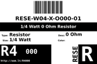
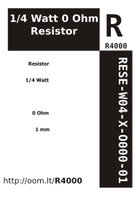
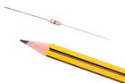

Contents
========

* [R4000 > 1/4 Watt 0 Ohm Resistor](#r4000--14-watt-0-ohm-resistor)
	* [Datasheets](#datasheets)
	* [Labels](#labels)
	* [EDA](#eda)
	* [Images](#images)
	* [Tags](#tags)
  
![][im]
# R4000 > 1/4 Watt 0 Ohm Resistor

- ID: RESE-W04-X-O000-01
- Hex ID: R4000
- Name: 1/4 Watt 0 Ohm Resistor
- Description: 1/4 Watt 0 Ohm Resistor
- Long Link: [http://oom.lt/RESE-W04-X-O000-01](http://oom.lt/RESE-W04-X-O000-01)
- Short Link: [http://oom.lt/R4000](http://oom.lt/R4000)

## Datasheets

- Datasheet: [datasheet.pdf](datasheet.pdf)

## Labels
  
  

|label-front|label-inventory|label-spec|
| :---: | :---: | :---: |
||||

## EDA

### Symbols
  

|[  SYMBOL-kicad-kicad-symbols-Device-R](https://github.com/oomlout/oomlout_OOMP_eda/tree/main/SYMBOL/kicad/kicad-symbols/Device/R/)||||
| :---: | :---: | :---: | :---: |

## Images
  
  

|image|image_RE|label-front|label-inventory|label-spec|
| :---: | :---: | :---: | :---: | :---: |
||||||

## Tags

- oompID: RESE-W04-X-O000-01
- name: 1/4 Watt 0 Ohm Resistor
- hexID: R4000
- oompSort: 0W040000000
- oompType: RESE
- oompSize: W04
- oompColor: X
- oompDesc: O000
- oompIndex: 01
- oompVersion: 99
- ooWidth: 62.8 mm
- ooDiameter: 2.5 mm
- ooLength: 6.8 mm
- ooMaterial: Carbon
- ooPowerRating: 1/4 W
- ooMaxVoltage: 500 V
- ooTolerance: 5%
- oompClass: Through Hole Component
- oompClassCode: THTH
- colorBand1: WHITE
- colorBand2: BLACK
- colorBand3: WHITE
- oompBbls: template;RESE-W04-X-XXXX-XX-bbls
- oompDiag: template;RESE-W04-X-XXXX-XX-diag
- oompIden: template;RESE-W04-X-XXXX-XX-iden
- oompSchem: template;RESE-XXXX-X-XXXX-XX-schem
- oompSimp: template;RESE-W04-X-XXXX-XX-simp
- ooDesignator: R1
- symbolKicad: SYMBOL-kicad-kicad-symbols-Device-R

[im]: image_450.jpg
