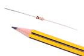
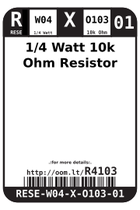
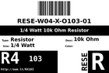
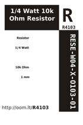

Contents
========

* [R4103 > 1/4 Watt 10k Ohm Resistor](#r4103--14-watt-10k-ohm-resistor)
	* [Images](#images)
	* [Datasheets](#datasheets)
	* [Labels](#labels)
	* [EDA](#eda)
	* [Tags](#tags)
  
![][im]
# R4103 > 1/4 Watt 10k Ohm Resistor

- ID: RESE-W04-X-O103-01
- Hex ID: R4103
- Name: 1/4 Watt 10k Ohm Resistor
- Description: 1/4 Watt 10k Ohm Resistor

## Images
  
  

|image|image_RE|label-front|label-inventory|label-spec|
| :---: | :---: | :---: | :---: | :---: |
||||||

## Datasheets

- Datasheet: [datasheet.pdf](datasheet.pdf)

## Labels
  
  

|label-front|label-inventory|label-spec|
| :---: | :---: | :---: |
||||

## EDA

### Symbols

## Tags

- oompID: RESE-W04-X-O103-01
- name: 1/4 Watt 10k Ohm Resistor
- hexID: R4103
- oompSort: 0W040010000
- oompType: RESE
- oompSize: W04
- oompColor: X
- oompDesc: O103
- oompIndex: 01
- oompVersion: 21
- ooWidth: 62.8 mm
- ooDiameter: 2.5 mm
- ooLength: 6.8 mm
- ooMaterial: Carbon
- ooMaxVoltage: 500 V
- ooTolerance: 5%
- oompClass: Through Hole Component
- oompClassCode: THTH
- colorBand1: BROWN
- colorBand2: BLACK
- colorBand3: ORANGE
- oompBbls: template;RESE-W04-X-XXXX-XX-bbls
- oompDiag: template;RESE-W04-X-XXXX-XX-diag
- oompIden: template;RESE-W04-X-XXXX-XX-iden
- oompSchem: template;RESE-XXXX-X-XXXX-XX-schem
- oompSimp: template;RESE-W04-X-XXXX-XX-simp
- ooDesignator: R1

[im]: image_450.jpg
