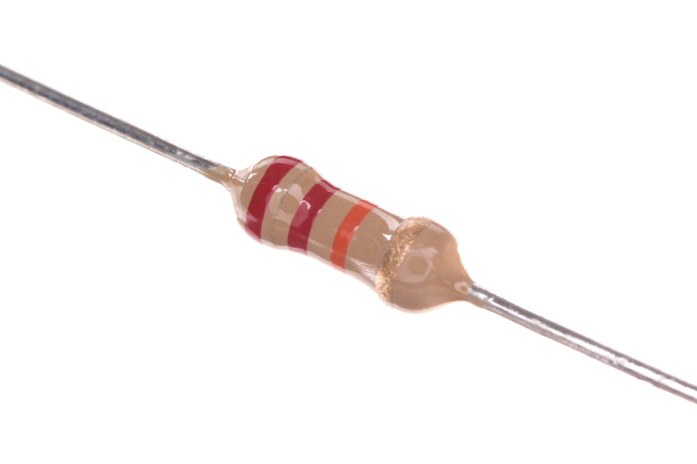
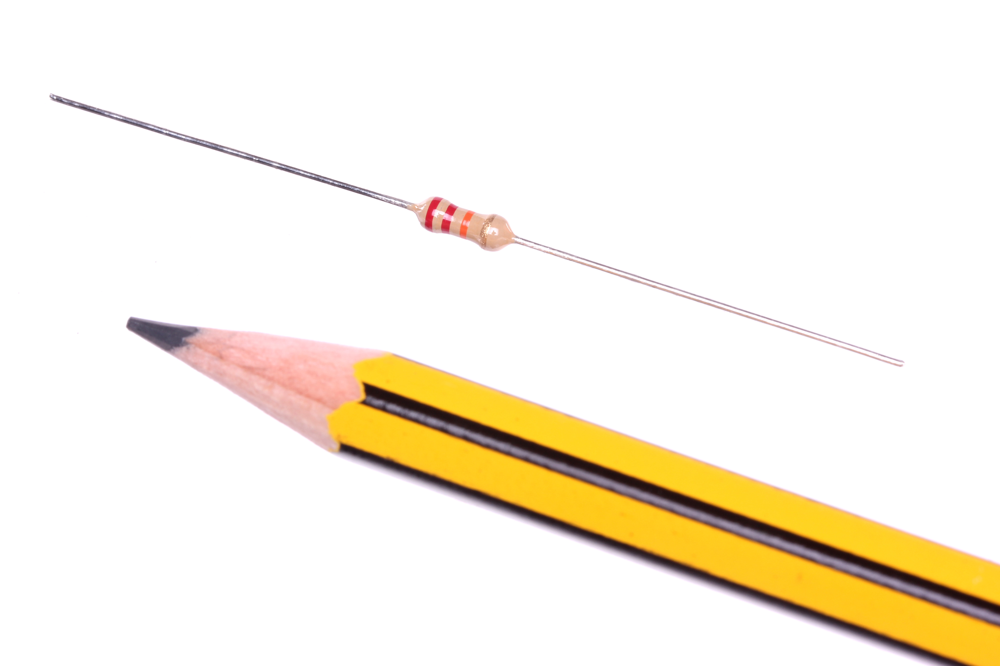

Contents
========

* [RESE-W04-X-O223-01>1/4 Watt 22k Ohm Resistor](#rese-w04-x-o223-0114-watt-22k-ohm-resistor)
	* [Images](#images)
	* [Datasheets](#datasheets)
	* [EDA](#eda)
		* [Symbols](#symbols)
	* [Tags](#tags)
  
![][im]
# RESE-W04-X-O223-01>1/4 Watt 22k Ohm Resistor

- ID: RESE-W04-X-O223-01
- Name: RESE-W04-X-O223-01

## Images
  
  

|Main|Reference|
| :---: | :---: |
|||

## Datasheets

- Datasheet: [datasheet.pdf](datasheet.pdf)

## EDA

### Symbols

## Tags

- index: 740
- index: 4153
- oompID: RESE-W04-X-O223-01
- name: 1/4 Watt 22k Ohm Resistor
- hexID: R4223
- oompSort: 0W040022000
- oompType: RESE
- oompSize: W04
- oompColor: X
- oompDesc: O223
- oompIndex: 01
- oompVersion: 99
- ooWidth: 62.8 mm
- ooDiameter: 2.5 mm
- ooLength: 6.8 mm
- ooMaterial: Carbon
- ooPowerRating: 1/4 W
- ooMaxVoltage: 500 V
- ooTolerance: 5%
- oompClass: Through Hole Component
- oompClassCode: THTH
- colorBand1: RED
- colorBand2: RED
- colorBand3: ORANGE
- oompBbls: template;RESE-W04-X-XXXX-XX-bbls
- oompDiag: template;RESE-W04-X-XXXX-XX-diag
- oompIden: template;RESE-W04-X-XXXX-XX-iden
- oompSchem: template;RESE-XXXX-X-XXXX-XX-schem
- oompSimp: template;RESE-W04-X-XXXX-XX-simp
- ooDesignator: R1

[im]: image_600.jpg
