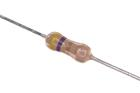

Contents
========

* [R447A > 1/4 Watt 4.7 Ohm Resistor](#r447a--14-watt-47-ohm-resistor)
	* [Datasheets](#datasheets)
	* [Labels](#labels)
	* [EDA](#eda)
	* [Images](#images)
	* [Tags](#tags)
  
![][im]
# R447A > 1/4 Watt 4.7 Ohm Resistor

- ID: RESE-W04-X-O47X-01
- Hex ID: R447A
- Name: 1/4 Watt 4.7 Ohm Resistor
- Description: 1/4 Watt 4.7 Ohm Resistor
- Long Link: [http://oom.lt/RESE-W04-X-O47X-01](http://oom.lt/RESE-W04-X-O47X-01)
- Short Link: [http://oom.lt/R447A](http://oom.lt/R447A)

## Datasheets

- Datasheet: [datasheet.pdf](datasheet.pdf)

## Labels
  
  

|label-front|label-inventory|label-spec|
| :---: | :---: | :---: |
||||

## EDA

### Symbols
  

|[  SYMBOL-kicad-kicad-symbols-Device-R](https://github.com/oomlout/oomlout_OOMP_eda/tree/main/SYMBOL/kicad/kicad-symbols/Device/R/)||||
| :---: | :---: | :---: | :---: |

## Images
  
  

|image|image_RE|label-front|label-inventory|label-spec|
| :---: | :---: | :---: | :---: | :---: |
||||||

## Tags

- oompID: RESE-W04-X-O47X-01
- name: 1/4 Watt 4.7 Ohm Resistor
- hexID: R447A
- oompSort: 0W040000004
- oompType: RESE
- oompSize: W04
- oompColor: X
- oompDesc: O47X
- oompIndex: 01
- oompVersion: 99
- oompClass: Through Hole Component
- oompClassCode: THTH
- colorBand1: YELLOW
- colorBand2: PURPLE
- colorBand3: GOLD
- oompBbls: template;RESE-W04-X-XXXX-XX-bbls
- oompDiag: template;RESE-W04-X-XXXX-XX-diag
- oompIden: template;RESE-W04-X-XXXX-XX-iden
- oompSchem: template;RESE-XXXX-X-XXXX-XX-schem
- oompSimp: template;RESE-W04-X-XXXX-XX-simp
- ooDesignator: R1
- symbolKicad: SYMBOL-kicad-kicad-symbols-Device-R

[im]: image_450.jpg
