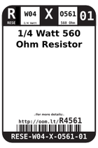
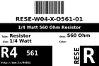
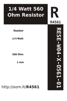

Contents
========

* [R4561 > 1/4 Watt 560 Ohm Resistor](#r4561--14-watt-560-ohm-resistor)
	* [Diagrams](#diagrams)
	* [Datasheets](#datasheets)
	* [Labels](#labels)
	* [EDA](#eda)
	* [Images](#images)
	* [Tags](#tags)
  
![][im]
# R4561 > 1/4 Watt 560 Ohm Resistor

- ID: RESE-W04-X-O561-01
- Hex ID: R4561
- Name: 1/4 Watt 560 Ohm Resistor
- Description: 1/4 Watt 560 Ohm Resistor
- Long Link: [http://oom.lt/RESE-W04-X-O561-01](http://oom.lt/RESE-W04-X-O561-01)
- Long Link: [http://oom.lt/R4561](http://oom.lt/R4561)

## Diagrams
  
  

|diagBBLS|diagDIAG|diagIDEN|diagSCHEM|diagSIMP|
| :---: | :---: | :---: | :---: | :---: |
||||||

## Datasheets

- Datasheet: [datasheet.pdf](datasheet.pdf)

## Labels
  
  

|label-front|label-inventory|label-spec|
| :---: | :---: | :---: |
||||

## EDA

### Symbols

## Images
  
  

|image|image_RE|diagBBLS|diagDIAG|diagIDEN|diagSCHEM|diagSIMP|label-front|label-inventory|label-spec|
| :---: | :---: | :---: | :---: | :---: | :---: | :---: | :---: | :---: | :---: |
|||||||||||

## Tags

- oompID: RESE-W04-X-O561-01
- name: 1/4 Watt 560 Ohm Resistor
- hexID: R4561
- oompSort: 0W040000560
- oompType: RESE
- oompSize: W04
- oompColor: X
- oompDesc: O561
- oompIndex: 01
- oompVersion: 21
- ooWidth: 62.8 mm
- ooDiameter: 2.5 mm
- ooLength: 6.8 mm
- ooMaterial: Carbon
- ooMaxVoltage: 500 V
- ooTolerance: 5%
- oompClass: Through Hole Component
- oompClassCode: THTH
- colorBand1: GREEN
- colorBand2: BLUE
- colorBand3: BROWN
- oompBbls: template;RESE-W04-X-XXXX-XX-bbls
- oompDiag: template;RESE-W04-X-XXXX-XX-diag
- oompIden: template;RESE-W04-X-XXXX-XX-iden
- oompSchem: template;RESE-XXXX-X-XXXX-XX-schem
- oompSimp: template;RESE-W04-X-XXXX-XX-simp
- ooDesignator: R1

[im]: image_450.jpg
