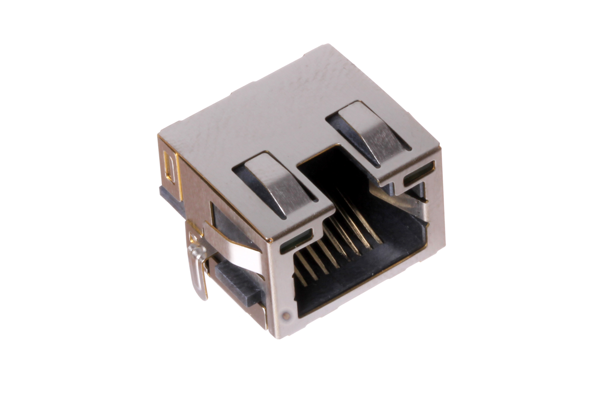
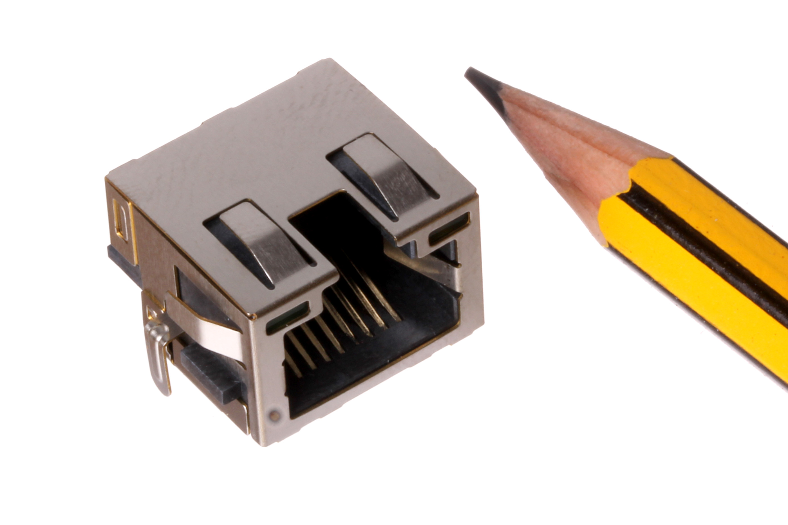
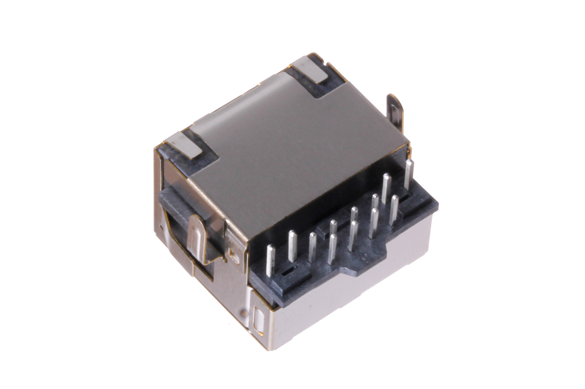
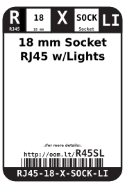

Contents
========

* [RJ45-18-X-SOCK-LI>18 mm Socket RJ45 w/Lights](#rj45-18-x-sock-li18-mm-socket-rj45-wlights)
	* [Images](#images)
	* [Datasheets](#datasheets)
	* [Labels](#labels)
	* [EDA](#eda)
		* [Symbols](#symbols)
	* [Tags](#tags)
  
![][im]
# RJ45-18-X-SOCK-LI>18 mm Socket RJ45 w/Lights

- ID: RJ45-18-X-SOCK-LI
- Name: RJ45-18-X-SOCK-LI

## Images
  
  

|Main|Reference|Bottom|
| :---: | :---: | :---: |
||||

## Datasheets

- Datasheet: [datasheet.pdf](datasheet.pdf)

## Labels
  
  

|Front|Inventory|Specifications|
| :---: | :---: | :---: |
||||

## EDA

### Symbols

## Tags

- index: 13052
- oompID: RJ45-18-X-SOCK-LI
- name: 18 mm Socket RJ45 w/Lights
- hexID: R45SL
- oompSort: 
- oompClass: Through Hole
- oompClassCode: THTH
- oompType: RJ45
- oompSize: 18
- oompColor: X
- oompDesc: SOCK
- oompIndex: LI
- oompVersion: 40
- ooDesignator: J1

[im]: image_600.jpg
