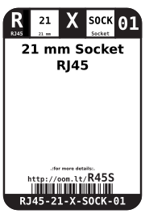
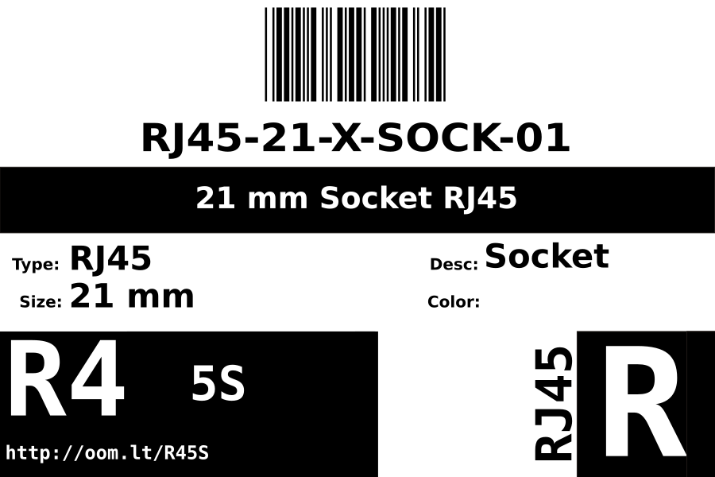
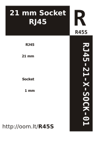

Contents
========

* [RJ45-21-X-SOCK-01>21 mm Socket RJ45](#rj45-21-x-sock-0121-mm-socket-rj45)
	* [Images](#images)
	* [Datasheets](#datasheets)
	* [Labels](#labels)
	* [EDA](#eda)
		* [Symbols](#symbols)
	* [Tags](#tags)
  
![][im]
# RJ45-21-X-SOCK-01>21 mm Socket RJ45

- ID: RJ45-21-X-SOCK-01
- Name: RJ45-21-X-SOCK-01

## Images
  
  

|image|image_RE|image_BOTTOM|
| :---: | :---: | :---: |
||||

## Datasheets

- Datasheet: [datasheet.pdf](datasheet.pdf)

## Labels
  
  

|label-front|label-inventory|label-spec|
| :---: | :---: | :---: |
||||

## EDA

### Symbols

## Tags

- oompID: RJ45-21-X-SOCK-01
- name: 21 mm Socket RJ45
- hexID: R45S
- oompSort: 
- oompClass: Through Hole
- oompClassCode: THTH
- oompType: RJ45
- oompSize: 21
- oompColor: X
- oompDesc: SOCK
- oompIndex: 01
- oompVersion: 40
- ooDesignator: J1

[im]: image_600.jpg
