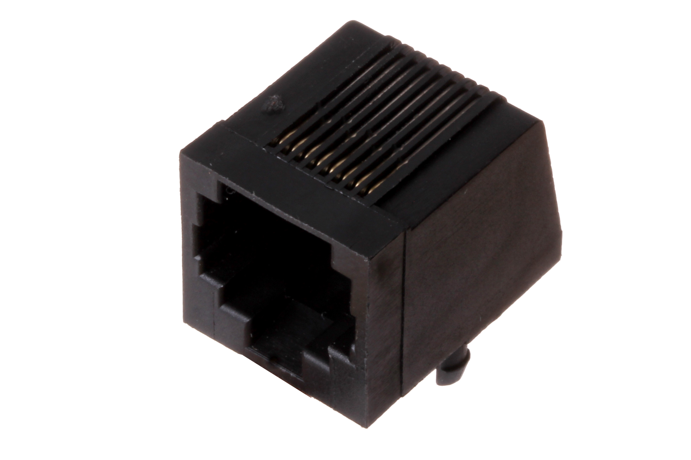
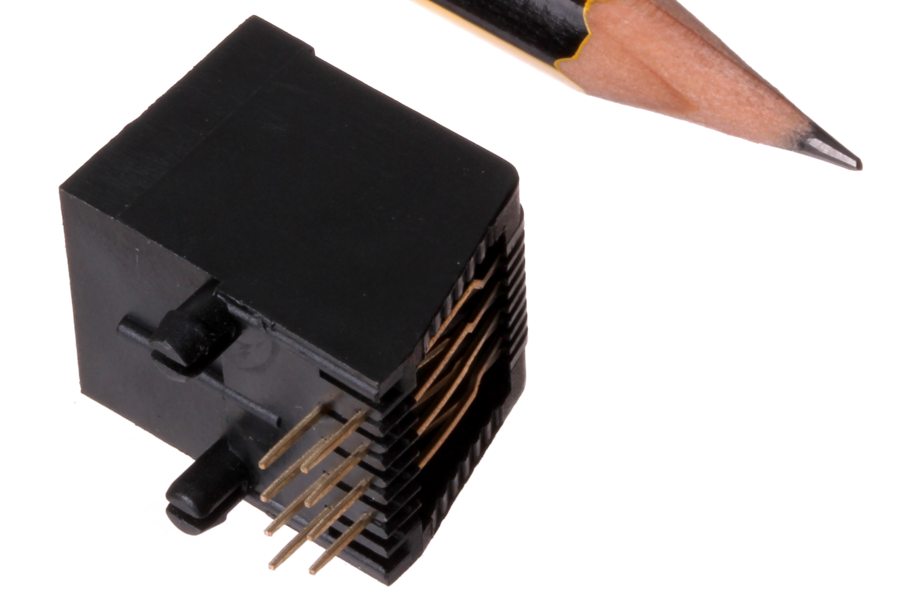
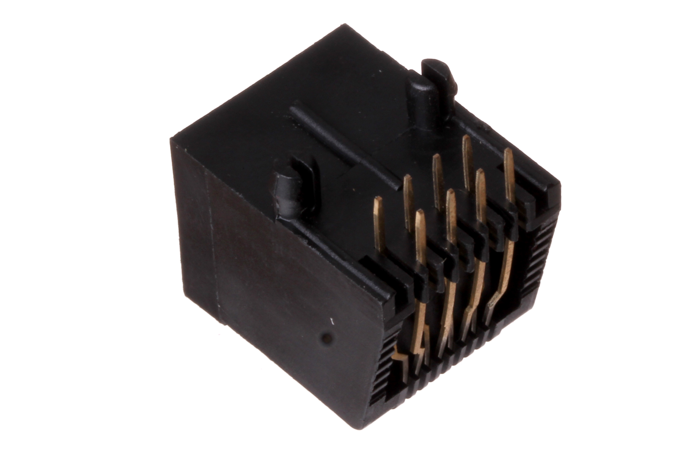

Contents
========

* [RJ45-21-X-SOCK-01>21 mm Socket RJ45](#rj45-21-x-sock-0121-mm-socket-rj45)
	* [Images](#images)
	* [Datasheets](#datasheets)
	* [EDA](#eda)
		* [Footprints](#footprints)
		* [Symbols](#symbols)
	* [Tags](#tags)

# RJ45-21-X-SOCK-01>21 mm Socket RJ45

- ID: RJ45-21-X-SOCK-01
- Name: RJ45-21-X-SOCK-01

## Images
  
  

|Main|Reference|Bottom|
| :---: | :---: | :---: |
||||

## Datasheets

- Datasheet: [datasheet.pdf](datasheet.pdf)

## EDA

### Footprints
  

|||||
| :---: | :---: | :---: | :---: |

### Symbols

## Tags

- index: 754
- oompID: RJ45-21-X-SOCK-01
- name: 21 mm Socket RJ45
- hexID: R45S
- oompSort: 
- oompClass: Through Hole
- oompClassCode: THTH
- oompType: RJ45
- oompSize: 21
- oompColor: X
- oompDesc: SOCK
- oompIndex: 01
- oompVersion: 40
- ooDesignator: J1
