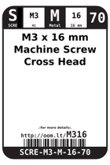
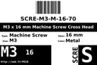
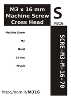

Contents
========

* [M316 > M3 x 16 mm Machine Screw Cross Head](#m316--m3-x-16-mm-machine-screw-cross-head)
	* [Images](#images)
	* [Datasheets](#datasheets)
	* [Labels](#labels)
	* [EDA](#eda)
	* [Tags](#tags)
  
![][im]
# M316 > M3 x 16 mm Machine Screw Cross Head

- ID: SCRE-M3-M-16-70
- Hex ID: M316
- Name: M3 x 16 mm Machine Screw Cross Head
- Description: M3 x 16 mm Machine Screw Cross Head

## Images
  
  

|image|image_RE|label-front|label-inventory|label-spec|
| :---: | :---: | :---: | :---: | :---: |
||||||

## Datasheets

- Datasheet: [datasheet.pdf](datasheet.pdf)

## Labels
  
  

|label-front|label-inventory|label-spec|
| :---: | :---: | :---: |
||||

## EDA

### Symbols

## Tags

- oompID: SCRE-M3-M-16-70
- name: M3 x 16 mm Machine Screw Cross Head
- hexID: M316
- oompSort: M3M316
- oompType: SCRE
- oompSize: M3
- oompColor: M
- oompDesc: 16
- oompIndex: 70
- oompVersion: 31
- oompClass: Hardware
- oompClassCode: HARD

[im]: image_450.jpg
