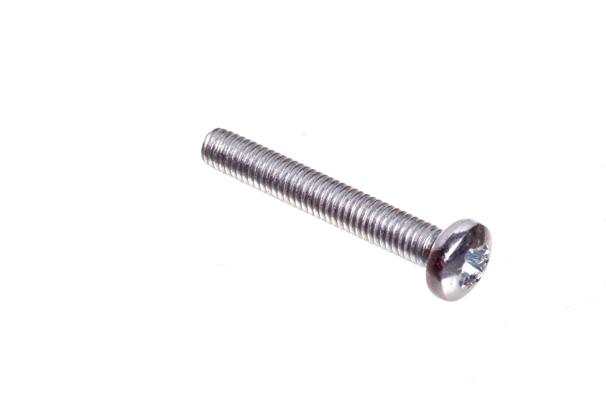

Contents
========

* [SCRE-M3-M-20-70>M3 x 20 mm Metal Machine Screw Cross Head](#scre-m3-m-20-70m3-x-20-mm-metal-machine-screw-cross-head)
	* [Images](#images)
	* [Datasheets](#datasheets)
	* [EDA](#eda)
		* [Footprints](#footprints)
		* [Symbols](#symbols)
	* [Tags](#tags)

# SCRE-M3-M-20-70>M3 x 20 mm Metal Machine Screw Cross Head

- ID: SCRE-M3-M-20-70
- Name: SCRE-M3-M-20-70

## Images
  
  

|Main|
| :---: |
||

## Datasheets

- Datasheet: [datasheet.pdf](datasheet.pdf)

## EDA

### Footprints
  

|||||
| :---: | :---: | :---: | :---: |

### Symbols

## Tags

- index: 757
- index: 9876
- oompID: SCRE-M3-M-20-70
- name: M3 x 20 mm Metal Machine Screw Cross Head
- hexID: M320
- oompSort: M3M320M
- oompType: SCRE
- oompSize: M3
- oompColor: M
- oompDesc: 20
- oompIndex: 70
- oompVersion: 99
- oompClass: Hardware
- oompClassCode: HARD
