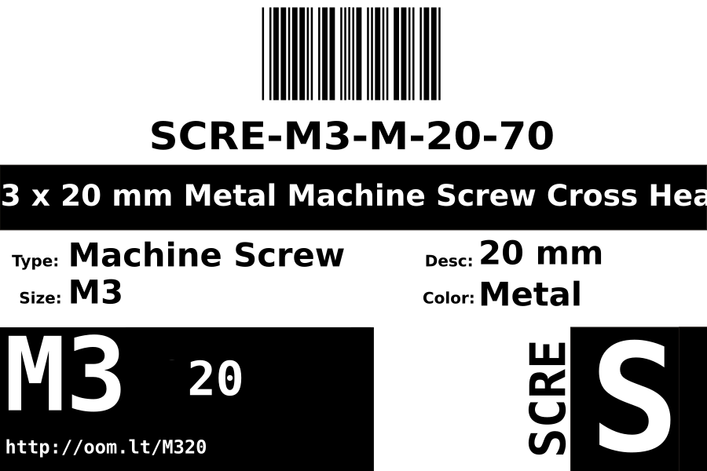

Contents
========

* [SCRE-M3-M-20-70>M3 x 20 mm Metal Machine Screw Cross Head](#scre-m3-m-20-70m3-x-20-mm-metal-machine-screw-cross-head)
	* [Images](#images)
	* [Datasheets](#datasheets)
	* [Labels](#labels)
	* [EDA](#eda)
		* [Symbols](#symbols)
	* [Tags](#tags)
  
![][im]
# SCRE-M3-M-20-70>M3 x 20 mm Metal Machine Screw Cross Head

- ID: SCRE-M3-M-20-70
- Name: SCRE-M3-M-20-70

## Images
  
  

|image|
| :---: |
||

## Datasheets

- Datasheet: [datasheet.pdf](datasheet.pdf)

## Labels
  
  

|label-front|label-inventory|label-spec|
| :---: | :---: | :---: |
||||

## EDA

### Symbols

## Tags

- oompID: SCRE-M3-M-20-70
- name: M3 x 20 mm Metal Machine Screw Cross Head
- hexID: M320
- oompSort: M3M320M
- oompType: SCRE
- oompSize: M3
- oompColor: M
- oompDesc: 20
- oompIndex: 70
- oompVersion: 99
- oompClass: Hardware
- oompClassCode: HARD

[im]: image_600.jpg
