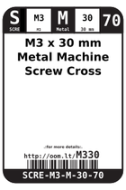
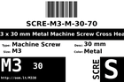
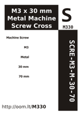
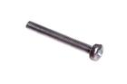

Contents
========

* [M330 > M3 x 30 mm Metal Machine Screw Cross Head](#m330--m3-x-30-mm-metal-machine-screw-cross-head)
	* [Datasheets](#datasheets)
	* [Labels](#labels)
	* [EDA](#eda)
	* [Images](#images)
	* [Tags](#tags)
  
![][im]
# M330 > M3 x 30 mm Metal Machine Screw Cross Head

- ID: SCRE-M3-M-30-70
- Hex ID: M330
- Name: M3 x 30 mm Metal Machine Screw Cross Head
- Description: M3 x 30 mm Metal Machine Screw Cross Head
- Long Link: [http://oom.lt/SCRE-M3-M-30-70](http://oom.lt/SCRE-M3-M-30-70)
- Long Link: [http://oom.lt/M330](http://oom.lt/M330)

## Datasheets

- Datasheet: [datasheet.pdf](datasheet.pdf)

## Labels
  
  

|label-front|label-inventory|label-spec|
| :---: | :---: | :---: |
||||

## EDA

### Symbols

## Images
  
  

|image|image_RE|label-front|label-inventory|label-spec|
| :---: | :---: | :---: | :---: | :---: |
||||||

## Tags

- oompID: SCRE-M3-M-30-70
- name: M3 x 30 mm Metal Machine Screw Cross Head
- hexID: M330
- oompSort: 030330M
- oompType: SCRE
- oompSize: M3
- oompColor: M
- oompDesc: 30
- oompIndex: 70
- oompVersion: 99
- oompClass: Hardware
- oompClassCode: HARD

[im]: image_450.jpg
