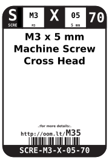
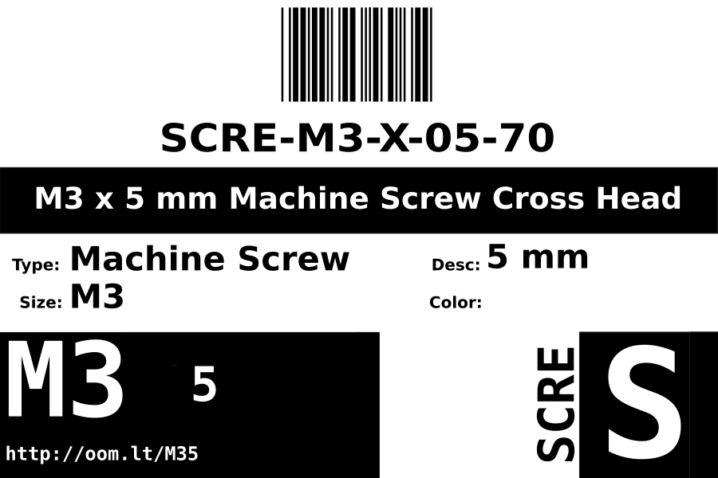

Contents
========

* [SCRE-M3-X-05-70>M3 x 5 mm Machine Screw Cross Head](#scre-m3-x-05-70m3-x-5-mm-machine-screw-cross-head)
	* [Datasheets](#datasheets)
	* [Labels](#labels)
	* [EDA](#eda)
		* [Symbols](#symbols)
	* [Tags](#tags)

# SCRE-M3-X-05-70>M3 x 5 mm Machine Screw Cross Head

- ID: SCRE-M3-X-05-70
- Name: SCRE-M3-X-05-70

## Datasheets

- Datasheet: [datasheet.pdf](datasheet.pdf)

## Labels
  
  

|label-front|label-inventory|label-spec|
| :---: | :---: | :---: |
||||

## EDA

### Symbols

## Tags

- oompID: SCRE-M3-X-05-70
- name: M3 x 5 mm Machine Screw Cross Head
- hexID: M35
- oompSort: SCREM305
- oompType: SCRE
- oompSize: M3
- oompColor: X
- oompDesc: 05
- oompIndex: 70
- oompVersion: 98
- ooDesignator: 0
