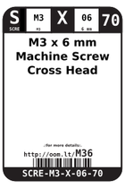
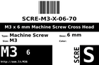
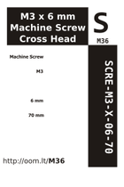

Contents
========

* [M36 > M3 x 6 mm Machine Screw Cross Head](#m36--m3-x-6-mm-machine-screw-cross-head)
	* [Datasheets](#datasheets)
	* [Labels](#labels)
	* [EDA](#eda)
	* [Images](#images)
	* [Tags](#tags)

# M36 > M3 x 6 mm Machine Screw Cross Head

- ID: SCRE-M3-X-06-70
- Hex ID: M36
- Name: M3 x 6 mm Machine Screw Cross Head
- Description: M3 x 6 mm Machine Screw Cross Head
- Long Link: [http://oom.lt/SCRE-M3-X-06-70](http://oom.lt/SCRE-M3-X-06-70)
- Short Link: [http://oom.lt/M36](http://oom.lt/M36)

## Datasheets

- Datasheet: [datasheet.pdf](datasheet.pdf)

## Labels
  
  

|label-front|label-inventory|label-spec|
| :---: | :---: | :---: |
||||

## EDA

### Symbols

## Images
  
  

|label-front|label-inventory|label-spec|
| :---: | :---: | :---: |
||||

## Tags

- oompID: SCRE-M3-X-06-70
- name: M3 x 6 mm Machine Screw Cross Head
- hexID: M36
- oompSort: SCREM306
- oompType: SCRE
- oompSize: M3
- oompColor: X
- oompDesc: 06
- oompIndex: 70
- oompVersion: 98
- ooDesignator: 0
