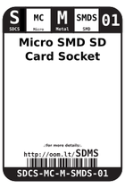
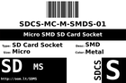
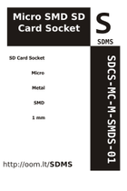
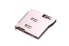
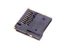

Contents
========

* [SDMS > Micro SMD SD Card Socket](#sdms--micro-smd-sd-card-socket)
	* [Datasheets](#datasheets)
	* [Labels](#labels)
	* [EDA](#eda)
	* [Images](#images)
	* [Tags](#tags)
  
![][im]
# SDMS > Micro SMD SD Card Socket

- ID: SDCS-MC-M-SMDS-01
- Hex ID: SDMS
- Name: Micro SMD SD Card Socket
- Description: Micro SMD SD Card Socket
- Long Link: [http://oom.lt/SDCS-MC-M-SMDS-01](http://oom.lt/SDCS-MC-M-SMDS-01)
- Short Link: [http://oom.lt/SDMS](http://oom.lt/SDMS)

## Datasheets

- Datasheet: [datasheet.pdf](datasheet.pdf)

## Labels
  
  

|label-front|label-inventory|label-spec|
| :---: | :---: | :---: |
||||

## EDA

### Symbols

## Images
  
  

|image|image_BOTTOM|label-front|label-inventory|label-spec|
| :---: | :---: | :---: | :---: | :---: |
||||||

## Tags

- oompID: SDCS-MC-M-SMDS-01
- name: Micro SMD SD Card Socket
- hexID: SDMS
- oompSort: MCMCSMD
- oompType: SDCS
- oompSize: MC
- oompColor: M
- oompDesc: SMDS
- oompIndex: 01
- oompVersion: 99
- ooManufacturer: C-SUNT
- ooManufacturerPartNumber: ST-TF-003A
- ooSEEEDsku: 3300060P1
- ooSEEEDdesc: Micro SD Card Socket
- ooSEEED3dModel: http://www.seeedstudio.com/wiki/File:9P-SMD-W-RING.zip
- oompClass: Surface Mount
- oompClassCode: SMDS
- ooDesignator: J1

[im]: image_450.jpg
