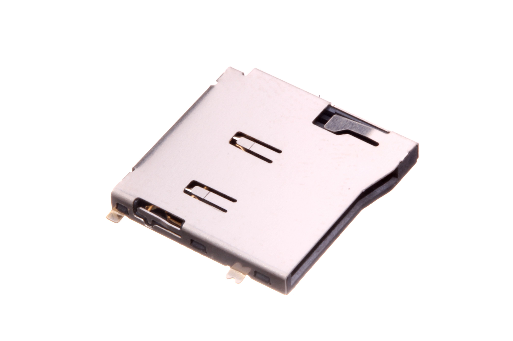
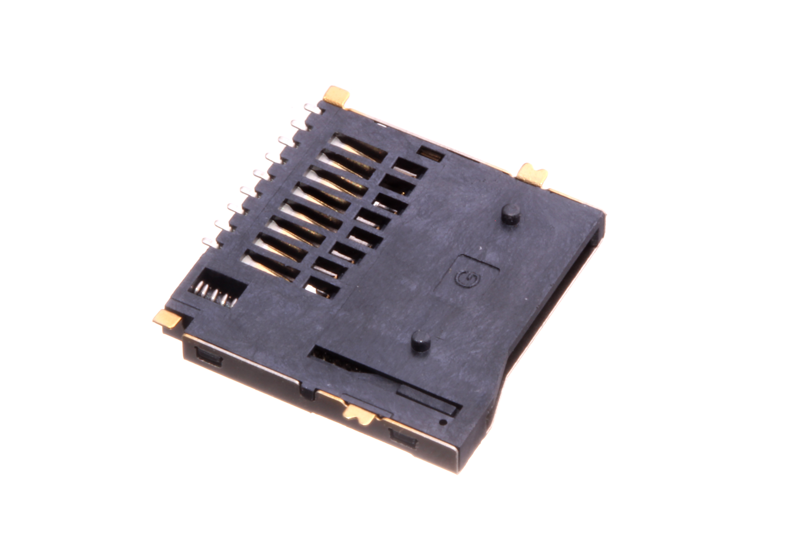
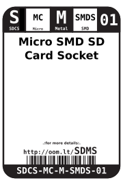
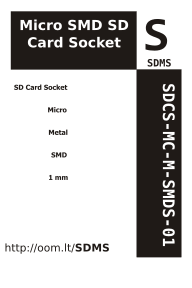

Contents
========

* [SDCS-MC-M-SMDS-01>Micro SMD Metal SD Card Socket](#sdcs-mc-m-smds-01micro-smd-metal-sd-card-socket)
	* [Images](#images)
	* [Datasheets](#datasheets)
	* [Labels](#labels)
	* [EDA](#eda)
		* [Symbols](#symbols)
	* [Tags](#tags)
  
![][im]
# SDCS-MC-M-SMDS-01>Micro SMD Metal SD Card Socket

- ID: SDCS-MC-M-SMDS-01
- Name: SDCS-MC-M-SMDS-01

## Images
  
  

|Main|Bottom|
| :---: | :---: |
|||

## Datasheets

- Datasheet: [datasheet.pdf](datasheet.pdf)

## Labels
  
  

|Front|Inventory|Specifications|
| :---: | :---: | :---: |
||||

## EDA

### Symbols

## Tags

- hexID: SDMS
- oompSort: MCMCSMD
- oompType: SDCS
- oompSize: MC
- oompColor: M
- oompDesc: SMDS
- oompIndex: 01
- oompVersion: 99
- ooManufacturer: C-SUNT
- ooManufacturerPartNumber: ST-TF-003A
- ooSEEEDsku: 3300060P1
- ooSEEEDdesc: Micro SD Card Socket
- ooSEEED3dModel: http://www.seeedstudio.com/wiki/File:9P-SMD-W-RING.zip
- oompClass: Surface Mount
- oompClassCode: SMDS
- ooDesignator: J1

[im]: image_600.jpg
