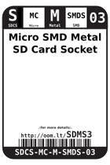
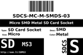
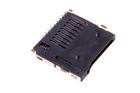

Contents
========

* [SDMS3 > Micro SMD Metal SD Card Socket](#sdms3--micro-smd-metal-sd-card-socket)
	* [Datasheets](#datasheets)
	* [Labels](#labels)
	* [EDA](#eda)
	* [Images](#images)
	* [Tags](#tags)
  
![][im]
# SDMS3 > Micro SMD Metal SD Card Socket

- ID: SDCS-MC-M-SMDS-03
- Hex ID: SDMS3
- Name: Micro SMD Metal SD Card Socket
- Description: Micro SMD Metal SD Card Socket
- Long Link: [http://oom.lt/SDCS-MC-M-SMDS-03](http://oom.lt/SDCS-MC-M-SMDS-03)
- Long Link: [http://oom.lt/SDMS3](http://oom.lt/SDMS3)

## Datasheets

- Datasheet: [datasheet.pdf](datasheet.pdf)

## Labels
  
  

|label-front|label-inventory|label-spec|
| :---: | :---: | :---: |
||||

## EDA

### Symbols

## Images
  
  

|image|image_RE|image_BOTTOM|label-front|label-inventory|label-spec|
| :---: | :---: | :---: | :---: | :---: | :---: |
|||||||

## Tags

- oompID: SDCS-MC-M-SMDS-03
- name: Micro SMD Metal SD Card Socket
- hexID: SDMS3
- oompSort: 
- oompClass: Surface Mount
- oompClassCode: SMDS
- oompType: SDCS
- oompSize: MC
- oompColor: M
- oompDesc: SMDS
- oompIndex: 03
- oompVersion: 40
- ooDesignator: J1

[im]: image_450.jpg
