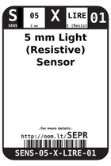

Contents
========

* [SEPR > 5 mm Light (Resistive) Sensor](#sepr--5-mm-light-resistive-sensor)
	* [Datasheets](#datasheets)
	* [Labels](#labels)
	* [EDA](#eda)
	* [Images](#images)
	* [Tags](#tags)

# SEPR > 5 mm Light (Resistive) Sensor

- ID: SENS-05-X-LIRE-01
- Hex ID: SEPR
- Name: 5 mm Light (Resistive) Sensor
- Description: 5 mm Light (Resistive) Sensor
- Long Link: [http://oom.lt/SENS-05-X-LIRE-01](http://oom.lt/SENS-05-X-LIRE-01)
- Short Link: [http://oom.lt/SEPR](http://oom.lt/SEPR)

## Datasheets

- Datasheet: [datasheet.pdf](datasheet.pdf)

## Labels
  
  

|label-front|label-inventory|label-spec|
| :---: | :---: | :---: |
||||

## EDA

## Images
  
  

|label-front|label-inventory|label-spec|
| :---: | :---: | :---: |
||||

## Tags

- oompID: SENS-05-X-LIRE-01
- name: 5 mm Light (Resistive) Sensor
- hexID: SEPR
- oompSort: SENS05LIRE
- oompType: SENS
- oompSize: 05
- oompColor: X
- oompDesc: LIRE
- oompIndex: 01
- oompVersion: 98
- ooDiameter: 5.0 mm
- ooNumPins: 2
- ooDesignator: 0
