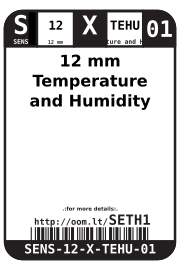
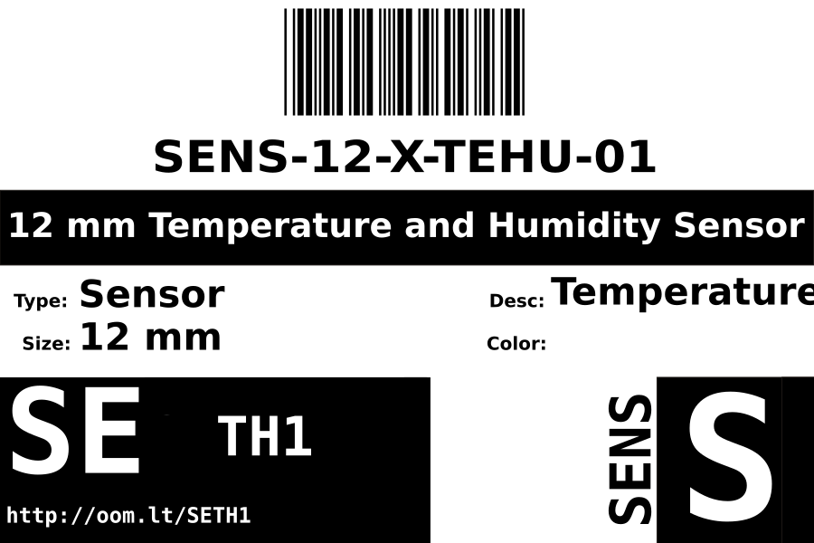
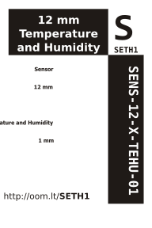

Contents
========

* [SENS-12-X-TEHU-01>12 mm Temperature and Humidity Sensor](#sens-12-x-tehu-0112-mm-temperature-and-humidity-sensor)
	* [Datasheets](#datasheets)
	* [Labels](#labels)
	* [EDA](#eda)
		* [Symbols](#symbols)
	* [Tags](#tags)

# SENS-12-X-TEHU-01>12 mm Temperature and Humidity Sensor

- ID: SENS-12-X-TEHU-01
- Name: SENS-12-X-TEHU-01

## Datasheets

- Datasheet: [datasheet.pdf](datasheet.pdf)

## Labels
  
  

|Front|Inventory|Specifications|
| :---: | :---: | :---: |
||||

## EDA

### Symbols

## Tags

- index: 766
- oompID: SENS-12-X-TEHU-01
- name: 12 mm Temperature and Humidity Sensor
- hexID: SETH1
- oompSort: SENS12TEHU
- oompType: SENS
- oompSize: 12
- oompColor: X
- oompDesc: TEHU
- oompIndex: 01
- oompVersion: 98
- ooDesignator: 0
