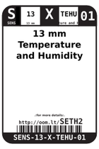
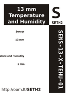

Contents
========

* [SETH2 > 13 mm Temperature and Humidity Sensor](#seth2--13-mm-temperature-and-humidity-sensor)
	* [Datasheets](#datasheets)
	* [Labels](#labels)
	* [EDA](#eda)
	* [Images](#images)
	* [Tags](#tags)

# SETH2 > 13 mm Temperature and Humidity Sensor

- ID: SENS-13-X-TEHU-01
- Hex ID: SETH2
- Name: 13 mm Temperature and Humidity Sensor
- Description: 13 mm Temperature and Humidity Sensor
- Long Link: [http://oom.lt/SENS-13-X-TEHU-01](http://oom.lt/SENS-13-X-TEHU-01)
- Short Link: [http://oom.lt/SETH2](http://oom.lt/SETH2)

## Datasheets

- Datasheet: [datasheet.pdf](datasheet.pdf)

## Labels
  
  

|label-front|label-inventory|label-spec|
| :---: | :---: | :---: |
||||

## EDA

## Images
  
  

|label-front|label-inventory|label-spec|
| :---: | :---: | :---: |
||||

## Tags

- oompID: SENS-13-X-TEHU-01
- name: 13 mm Temperature and Humidity Sensor
- hexID: SETH2
- oompSort: SENS13TEHU
- oompType: SENS
- oompSize: 13
- oompColor: X
- oompDesc: TEHU
- oompIndex: 01
- oompVersion: 98
